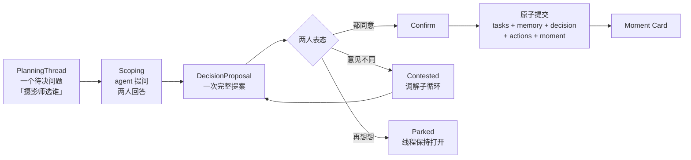
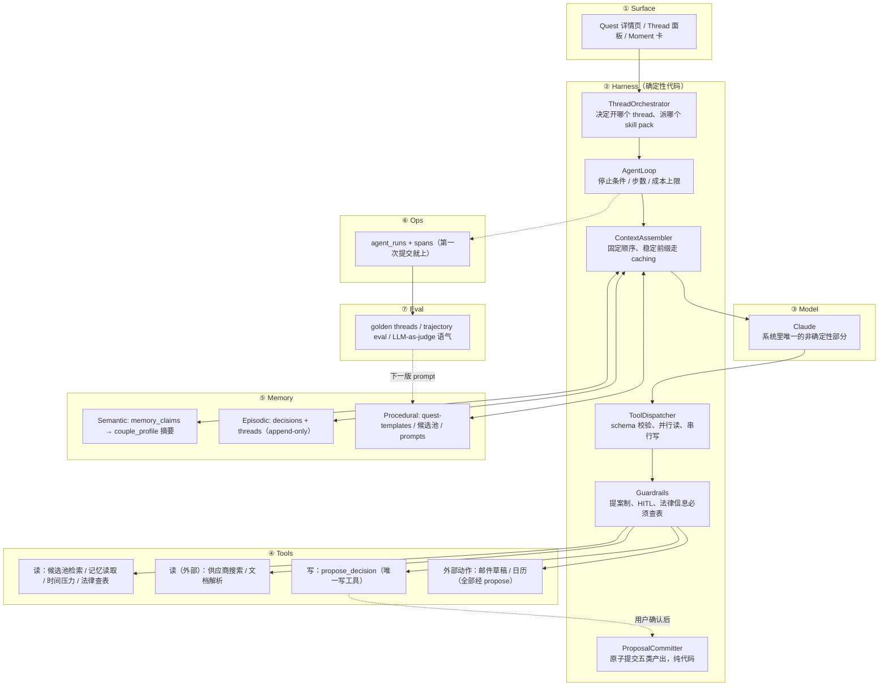
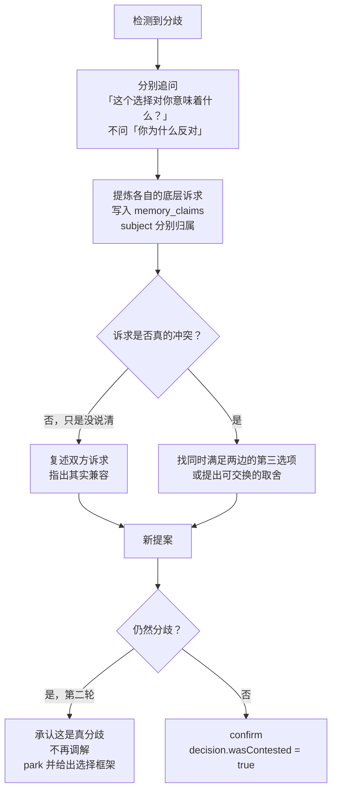

# Bliss — Agentic System Design

> **这份文档取代 [DESIGN.md](DESIGN.md) 的 §2–§7。** 术语与分层遵循
> [docs/other/AGENTIC-SYSTEM-REFERENCE.md](docs/other/AGENTIC-SYSTEM-REFERENCE.md)。
> 产品意图仍以 [PRD.md](PRD.md) 为准，但 §5 的"确定性骨架 + 决策点嵌入 agent"
> 需按本文 §1 重新理解。

---

## 0. 这一版改了什么

**一句话：系统的原子单位从「一组任务」换成「一次共同决定」。**

旧设计的中心是 Resolver：拿到答案 → 筛任务池 → 生成清单。任务是产物，决定是
达成任务的手段。

新设计的中心是 **DecisionProposal**：一次共同决定被提出、两个人各自表态、共同
确认，然后**同时**落下五样东西——任务、记忆、外部动作、时间调整、一张 Moment
草稿。任务只是这次决定的五分之一。

```
旧：  answers → Resolver → tasks                      （清单工具）
新：  PlanningThread → DecisionProposal → Confirm →    （决策伴侣）
        ├── tasks          执行什么
        ├── memory_claims  我们是什么样的人
        ├── decisions      我们怎么走到这一步（append-only）
        ├── external_actions  帮我们做掉（邮件 / 日历 / 找供应商）
        └── moment_draft   这一刻值得记住
```

Resolver **不删除，降级**。它从"系统心脏"变成"候选任务池的确定性检索器"——
一个被 agent 调用的工具，不再是主流程。它已经写好的 1000 行内容与谓词求值
全部保留并继续有用（见 §4.1）。

**为什么这个改动是必须的：** 清单是可以被抄的，The Knot 有 400 人在抄。
「两个人如何做出这个决定的完整记录」抄不了，因为它不是内容，是关系的沉淀物。
如果原子单位是任务，这份沉淀物就只能是任务的副产品，永远长不出来。

---

## 1. 产品主循环



**Thread 是长的，Run 是短的。** PlanningThread 可以跨天存在（"摄影师这事我们
聊了三次"），但每一次 agent 执行仍是一次 **ephemeral run**——用完即弃，状态只
靠写进 memory 存活（参考文档图 2）。Thread 是数据，不是进程。

### 1.1 五条不可违反的规则

| # | 规则 | 违反的后果 |
|---|---|---|
| 1 | Agent 永远不直接写业务表，只能产出 proposal | 「AI 擅自改了我的东西」，信任一次性归零 |
| 2 | 一次 confirm 原子提交全部五类产出 | 出现只有任务没有理由的孤儿数据，决策链断裂 |
| 3 | 任何外部动作（发邮件、建日程）必须二次确认 | 代表用户对外发言，不可撤销 |
| 4 | Thread 永不阻塞。任何时候都能 park | 违背 PRD §11 第五行：什么都不答也要有完整计划 |
| 5 | Moment 是草稿，永远等用户确认 | 变成"帮你写好的日记"，即 PRD §8.1 要防的那件事 |

---

## 2. 分层架构

对照参考文档图 1，标注 Bliss 每一层的落点与状态。



**关键结构差异（相对旧 DESIGN）：** `ProposalCommitter` 在 harness 层，是普通
代码。模型产出提案，**提交由代码完成**。旧设计里 `commit_tasks` 是模型可调用的
终止工具，那意味着模型持有写权限——本文取消这一点。

---

## 3. 数据模型

### 3.1 两个人：采用的简化方案

**决定：两个 user 角色共享一个 wedding，内容全部共享，不做可见性分级。**

已有的 [`wedding_members`](apps/api/src/db/schema/weddings.ts#L64) 直接满足。
明确**不做**：私密笔记、给对方的惊喜、每条记忆的 visibility scope、分角色权限。

代价（明确接受）：不支持"我想偷偷准备一个惊喜"这类场景。若将来要，加一个
`visibility` 字段即可，不影响本文任何其他结构。

**但保留的最小双人性——两条：**

1. 每条 `memory_claim` 记录**它属于谁**（`subject`: partner_a / partner_b / couple）。
   "她想要花园风"和"他们想要花园风"是两件不同的事，混在一起，assistant 就会
   把一个人的偏好当成两个人的共识说出口。这是最伤感情的失误，且零成本可避免。
2. 每个 `decision_proposal` 上，两个人**各自可以有不同的态度**。

这两条加起来是两个字段和一张小表，不是一套权限系统。

### 3.2 表

```ts
// ── 决策 ───────────────────────────────────────────────────────────

planning_threads {
  id, weddingId, questKey
  title              // "选摄影师"
  status             // open | proposing | contested | resolved | parked
  openedBy           // partner_a | partner_b | system
  resolvedDecisionId // 收敛到哪次决定
  createdAt, updatedAt
}

decision_proposals {
  id, threadId, weddingId, agentRunId
  question           // "摄影风格走哪个方向？"
  options            // [{ key, label, rationale, tradeoffs, estCostRange }]
  recommendedOption  // agent 的建议，可为空
  recommendationBasis// 引用了哪几条 memory_claim（id 数组）
  payload            // ↓ 确认后要落的全部东西，见 §3.3
  status             // pending | contested | confirmed | superseded | rejected
  createdAt
}

proposal_reactions {              // ← 双人性的全部实现
  id, proposalId
  memberRole         // partner_a | partner_b
  stance             // agree | prefer_other | need_to_talk
  chosenOption       // 若 prefer_other，他选的是哪个
  note               // 可选，一句话
  createdAt
}
// 两条 reaction 的 chosenOption 不一致 → thread 转 contested，触发调解循环（§6）

decisions {                        // episodic，append-only，永不 UPDATE
  id, weddingId, threadId, questKey
  question, chosenOption
  reason             // ← 最有价值的一列
  decidedBy          // partner_a | partner_b | both | assumed
  confidence         // high | medium | low
  supersedesId       // 改主意时链接旧决定，不覆盖
  wasContested       // 这次决定是否经历过分歧
  proposalId, createdAt
}
```

```ts
// ── 记忆 ───────────────────────────────────────────────────────────

memory_claims {                    // semantic 的真实来源
  id, weddingId
  subject            // partner_a | partner_b | couple
  key                // "style.aesthetic" | "budget.posture" | "ruled_out"
  value
  source             // stated | confirmed | inferred | decision_derived
  evidenceType       // message | decision | proposal_reaction
  evidenceId         // 指回原始出处
  confidence         // 0..1
  supersededById     // 被哪条新 claim 取代
  createdAt
}

couple_profile_snapshot {          // 派生摘要，可随时重建，非真实来源
  weddingId, computedAt
  summary            // 由 claims 计算出的当前视图，喂给 context assembler
}
```

**为什么要 `memory_claims`（我的理由，与另一份 review 不同）：** 不是为了权限，
是为了**可反驳性**。Agent 一定会推断错——它会从"我们不想太隆重"推出"预算敏感"，
然后在戒指那一节建议省钱，而对方其实想在戒指上花钱。如果 profile 是可覆盖的
散字段，你**永远查不出这个结论是哪来的**，只能整体不信任它。有了 evidence 链，
UI 上就能做到一件事：**用户点开任何一条 assistant 说出口的推断，看到它的出处，
一键否掉。** 这就是 PRD §5.1 那张表里"being wrong = 一个可被纠正的提案"真正
落地的地方。

```ts
// ── 执行与记忆产物 ─────────────────────────────────────────────────

external_actions {
  id, weddingId, decisionId
  kind               // draft_email | calendar_event | vendor_shortlist
  payload            // 草稿全文 / 事件详情 / 供应商列表
  status             // proposed | approved | executed | failed | discarded
  approvedBy, executedAt, resultRef
}

moments {
  id, weddingId, decisionId
  kind               // decision | milestone | photo_pair
  draftBody          // 生成的叙述草稿
  status             // draft | confirmed | edited | hidden
  userBody           // 用户改过的版本（若有）
  mediaIds, createdAt, confirmedAt
}
```

```ts
// ── 可观测 ─────────────────────────────────────────────────────────

agent_runs {
  id, weddingId, threadId
  loop               // scoping | mediation | companion | moment_gen
  goal
  promptVersion, toolsVersion, modelId    // artifact registry，三个都要
  steps, tokensIn, tokensOut, costUsd, latencyMs
  stopReason         // natural | terminal | budget | user | guard
  outcome            // proposal_created | parked | failed
  createdAt
}

agent_spans {
  id, runId, parentSpanId
  kind               // llm_call | tool_call | retrieval
  name, input, output, error, startedAt, endedAt
}
```

**从第一次提交就写这两张表。** 参考文档说得很准：trace 是 eval 的原料，事后
补不回来。

---

## 4. Tools

**读工具可以宽，写工具只有一个。**

```ts
// ── 读：内部 ──────────────────────────────────────────────
get_wedding_context()                    // 基本事实 + profile 摘要
get_memory(subject?, keys?)              // 带 evidence 的 claims
get_decisions(questKey?)                 // 含 supersedes 链，防重复提问
get_candidate_tasks(questKey, answers)   // ← 旧 Resolver 在这里活下来
get_timeline_pressure(questKey)          // slack、阻塞项、驱动决策
lookup_marriage_license(state, county?)  // 法律信息唯一合法来源

// ── 读：外部 ──────────────────────────────────────────────
search_vendors(criteria)                 // 可并行，只读，天然适合子 agent
read_uploaded_document(fileId)           // 报价单 / 合同 → 结构化

// ── 写：唯一一个 ──────────────────────────────────────────
propose_decision({
  threadId, question, options[],
  recommendedOption?, recommendationBasis[],
  payload: {
    tasks[],            // 从候选池选，不许自创
    memoryClaims[],     // 每条必须带 evidence
    externalActions[],  // 邮件草稿 / 日历 / 供应商名单
    timelineChanges[],
    momentDraft?,
  }
}) → { proposalId }
```

没有 `commit_*`。没有 `record_decision`。没有 `update_profile`。没有
`adjust_timeline`。**这四个旧写工具全部并入 `propose_decision` 的 payload。**
提交由 `ProposalCommitter`（普通代码，一个事务）在用户确认后执行。

这样做的收益是结构性的：**「两阶段写入」不再是一条需要被遵守的纪律，而是一个
无法违反的事实**——因为模型的工具表里根本不存在写路径。旧设计里
`record_decision` / `update_profile` / `adjust_timeline` 可以绕过确认，那不是
疏忽，是工具表结构决定的必然漏洞。

### 4.1 Resolver 的新位置

已写的 [predicates.ts](apps/api/src/content/predicates.ts)、
[quest-resolver.ts](apps/api/src/services/quest-resolver.ts)、
[validate-content.ts](apps/api/src/content/validate-content.ts) **全部保留**，
它们成为 `get_candidate_tasks` 的实现。

变化只有一处，但很关键：**它的输出不再直接是用户看到的清单，而是给 agent 看的
候选池。** Agent 从池子里选 5–8 条，附上理由，放进提案。

这同时解决了另一份 review 的第 8 条：现在的 "rent 205 个任务 vs custom 208 个
任务"之所以荒谬，正是因为把候选池当成了成品清单。**候选池就该有 200 条，成品
清单必须只有 8 条。** 两个数字都对，只是角色不同。

---

## 5. Agent Loop

```ts
const STOP = {
  natural:  () => !response.toolCalls.length,
  terminal: () => calledAny(['propose_decision']),
  budget:   () => steps > 8 || tokens > 40_000 || elapsedMs > 30_000,
  user:     () => signal.aborted,
  guard:    () => unrecoverableGuardrailError,
}
```

**Context 装配顺序**（稳定块在前，吃满 prompt caching）：

```
[System]        角色、语气规范、硬禁止              ~400 tok   稳定
[Skill Pack]    quest 专属提示 + 工具子集           ~400 tok   每 quest 稳定
[Memory]        claims 摘要，分 partner_a/b/couple  ~400 tok
[Decisions]     本 quest + 跨 quest 关键决定        ~500 tok
[Thread]        本线程历史，含分歧记录              ~400 tok
[Timeline]      slack、阻塞项                       ~100 tok
                                              总计 ~2.5–3k tok
```

### 5.1 Guardrails（dispatch 层强制）

| 检查 | 违反行为 |
|---|---|
| 调用了不在 skill pack 子集里的工具 | 拒绝，返回模型可读的错误 |
| 提案任务超过 8 条 | 拒绝。防的就是任务墙 |
| 任务不在 `get_candidate_tasks` 返回的池子里 | 拒绝。模型只选，不发明 |
| `memoryClaim` 缺 evidence | 拒绝 |
| 法律 / 前置周期声明未来自查表工具 | 剥离并重新提示 |
| `externalAction` 未标记为需确认 | 拒绝 |
| 提案没有 `recommendationBasis`，却给了推荐 | 拒绝。推荐必须能说出凭什么 |

---

## 6. 调解循环（Mediation Loop）

**这是本文档里唯一一个旧设计完全没有的能力，也是产品初心的落点。**

PRD §5.2 说预算两个 loop。改为**三个**，因为分歧是一个独立的、有不同目标的
对话：scoping 的目标是收敛到一个选择，调解的目标是**让两个人都感到被听见**，
这两件事的成功标准不一样。

触发条件：一个 proposal 上两条 reaction 的 `chosenOption` 不一致。



**调解循环的硬约束：**

| 规则 | 理由 |
|---|---|
| 最多两轮，然后必须 park | 第三轮 AI 调解会变成说教。这是产品失败点 |
| 永远不偏向任何一方 | 一次站队，另一个人永久流失 |
| 分歧本身写进 memory_claims，不写进"谁对" | 记录诉求，不记录胜负 |
| 允许"我们线下聊聊"作为一等结果 | 有些事不该在 app 里解决 |
| `wasContested` 的决定，Moment 优先级最高 | 一起跨过分歧，是最值得记住的时刻 |

最后一条是整个产品的情感高点：**Moment 不该是"你们选了花园风"，而是"你们本来
想的不一样，聊完之后一起选了花园风，因为她说想要照片里有光"。** 后者只有拿到
`wasContested` 和双方 claim 才写得出来。这就是为什么 §3.1 那两条最小双人性不能
再砍。

---

## 7. 时间：先诚实，再精确

**改名：不叫 CPM Scheduler，叫 `DeadlineHeuristic`。** 现在的实现
（[quest-generator.ts](apps/api/src/services/quest-generator.ts#L38-L76)）是
按 quest 顺序做的前向估算，它不是关键路径法，叫 CPM 会让人（包括未来的你）
高估它。

现有实现还有一个未被断言的隐式不变量：前置 quest 必须 `order` 更小，否则前置
关系**静默失效**。当前内容满足，但没有检查。补进 validate-content。

**v1 只做三件事，做扎实：**

1. `task_dependencies` 显式依赖表，取代靠 `order` 的隐式拓扑
2. 按周做容量分配——多个并行任务共同争抢每周 5 小时，这是现在完全没建模的
3. 负 slack 触发**决策重开**（"6 个月来不及定制婚纱，要不要看看租赁"），
   不是弹一个警告

第 3 条是这一层与产品主循环的接口：**时间压力不是通知，是一个新的
PlanningThread。**

---

## 8. Eval

参考文档图 4 的闭环，v1 取最小可用子集。

**Golden Threads**（不是 golden paths——评的是整条决策线程）：

| 场景 | 断言 |
|---|---|
| 12 个月 · 租赁婚纱 | 提案不含修改与试穿；含"提前穿鞋磨合" |
| 6 个月 · 定制婚纱 | 时间压力主动开出重新决策的 thread |
| 两人对摄影预算意见不同 | 进调解循环；两轮内 resolve 或 park；从不站队 |
| 曾排除目的地婚礼 | 任何 quest 的任何提案永不再提 |
| 两人全程"你决定" | 仍产出完整计划，全部标记 assumed |
| 中式 + 美式 · WA 州 | 出现茶礼任务；等待期来自查表而非模型 |

**三类评测，缺一不可：**

- **确定性断言** — 提案结构、任务数 ≤ 8、每条 claim 有 evidence、法律信息有来源
- **Trajectory eval** — 工具序列对不对。典型：是否在提问**之前**调了
  `get_decisions`（不查就问 = 重复提问 = 信任杀手）
- **LLM-as-judge** — 语气。判据来自 `docs/VOICE.md`（**仍未写，仍是头号阻塞项**）

**Release gate：** prompt / 工具 schema / 候选池的任何改动，不过 golden threads
不许合。`agent_runs` 里的三个版本字段就是为此存在。

---

## 9. 新的 Sprint 顺序

**停止扩写剩下 12 个 quest。** 理由不是内容不重要，是现在还不知道提案里应该
放什么形状的东西——在这之前每写一个 quest 都是在赌。

| # | 内容 | 退出标准 |
|---|---|---|
| **1** | `docs/VOICE.md` + 回校已写文案 | 语气规范写死，能当 judge 的判据 |
| **2** | 新表 + `ProposalCommitter` + trace | 手工构造的 proposal 能原子提交五类产出 |
| **3** | **摄影师单场景纵向切片** | 真 harness、真提案、真确认、CLI 跑通即可，无 UI |
| **4** | 调解循环 | 两人选不同 → 两轮内 resolve 或 park，从不站队 |
| **5** | 执行层：供应商搜索 + 邮件草稿 + 日历 | 三者都走 propose → 确认 → 执行 |
| **6** | Moment 草稿进同一次提交 | 摄影师这一次决定，产出一张能读的卡片 |
| **7** | **5 对真实 couple 走完整条线程** | 有人愿意接着用第二个 quest |
| **8** | 再决定是否扩内容池与调度器 | 由第 7 步的数据决定，不由计划决定 |

**Sprint 3 是新的 go/no-go 点。** 它要回答的问题不再是"筛选逻辑对不对"（那个
已经答完了，40 个测试全过），而是：**一次共同决定，能不能真的同时产出任务、
记忆、动作和一段值得读的话。** 这件事在一个 quest 上做不成，做十四个也没用。

注意 Sprint 3 只需要 **attire 或 photo 一个 quest 的内容**——它们是现有 14 个
里唯二写了 scoping questions 的（[quest-templates.ts:291](apps/api/src/content/quest-templates.ts#L291)、
[:604](apps/api/src/content/quest-templates.ts#L604)），所以起点是现成的。

---

## 10. 相对旧 DESIGN 的差异

| # | 旧 | 新 | 为什么 |
|---|---|---|---|
| 1 | Resolver 是系统心脏 | Resolver 是一个读工具 | 决定才是原子单位，任务是产物 |
| 2 | `task_proposals` | `decision_proposals` | 一次确认落五类产出，不只是任务 |
| 3 | 4 个写工具 | 1 个（`propose_decision`） | 让两阶段写入从纪律变成结构 |
| 4 | 模型调 `commit_tasks` | 代码提交，模型无写权限 | 模型不该持有事务边界 |
| 5 | 共享 profile 可覆盖 | `memory_claims` 带 evidence | 推断错了要能查到出处并否掉 |
| 6 | 单一 `decidedBy` | claim 归属 + proposal reactions | 一个人的偏好≠两个人的共识 |
| 7 | 2 个 loop | 3 个（+ 调解） | 分歧的成功标准与收敛不同 |
| 8 | Moment 排到 Sprint 7 | 进第一个闭环 | 它是目的，不是收尾功能 |
| 9 | CPM Scheduler | DeadlineHeuristic + 周容量 | 别把估算叫调度 |
| 10 | 无外部工具 | 供应商 / 邮件 / 日历进 v1 | "轻松"的唯一来源是替他们做掉 |
| 11 | 保留：单主 agent | 保留 | 上下文分裂的代价仍然成立 |
| 12 | 保留：不用向量库 | 保留 | claims 规模下结构化表更准更好 debug |

---

## 11. 仍然待定

1. **`docs/VOICE.md`** — 最高优先级。它同时是文案基准和 LLM-judge 的判据，
   两个都堵在这。
2. **Companion Loop 要不要常驻聊天面** — 建议推迟到 Sprint 7，用真实用户
   数据决定。
3. **`marriage-license.ts` 的 `validityDays` / `witnessesRequired` 仍是全国
   默认值**，不是分州查证。上线阻塞项，未解决。
4. **供应商数据源** — Sprint 5 前必须定：接现成 API，还是先用地图搜索兜底。
