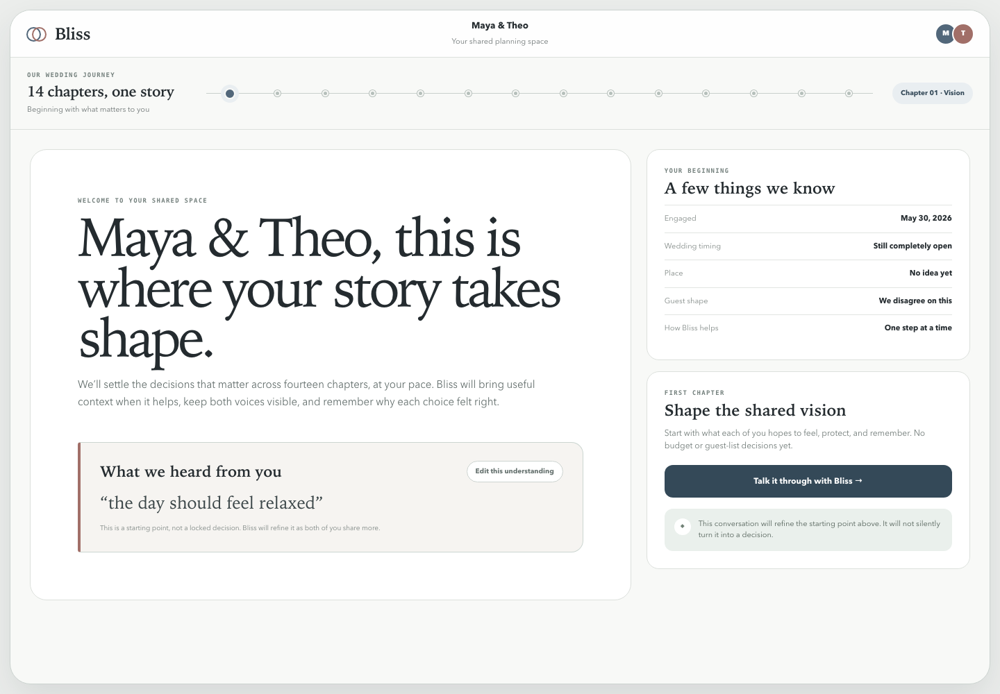

# Bliss — AI-Native Wedding Planning Companion

A wedding planning companion for two people sharing one workspace. Bliss helps a
couple reach a decision that fits them, executes the small next actions, and
remembers why the choice mattered — instead of generating a checklist and
leaving them to it.

Monorepo: a Next.js web app and a Fastify API, with a hand-written agent runtime.

## Live production

**Production app:** [Open Bliss on Vercel](https://bliss-bliss-72c2.vercel.app/)

This deployment runs the prototype-backed product UI from `apps/web` against
the deployed Railway API. It includes the animated landing experience, real
Clerk authentication, onboarding, the couple home, and question-scoped
workspaces across the 14-quest journey.

| Surface | Verified behavior |
|---|---|
| Landing and authentication | Public routes render the prototype product experience |
| Signed-in product routes | Server-protected and returned to the requested page after sign-in |
| Question workspaces | One permanent thread per authored question, with independent conversation and decision state |
| API connection | Railway health, database, agent, private media, exact CORS, and unauthorized boundaries verified |
| Release checks | Automated tests plus deployed route, auth, CORS, readiness, and cron canaries |



<sub>The image is a design reference; the linked preview is the running implementation.</sub>

---

## The engineering thesis

The model is probabilistic; the side effects are not reversible. So the agent
**proposes**, and deterministic code **commits** after the required approval.
Nearly every architectural decision here follows from that one line.

| Concern | How it is enforced |
|---|---|
| Runaway loops | Four independent budgets — steps, tokens, cost, wall-clock — checked every iteration; every run ends on an explicit stop reason |
| Hallucinated tools | Tool allowlist built from what the caller passed; unregistered calls become structured guardrail events |
| Silent writes | The model holds no write tool. State changes flow through a Decision Packet a user confirms |
| Duplicate real-world actions | Durable leases, bounded retries with backoff, stable provider idempotency keys |
| Prompt regressions | 283-case release gate in CI; a non-zero exit blocks promotion |
| Trace privacy | Per-tool allowlisted projection — traces record shape and counts, never assistant prose or reasoning |

Full architecture: [docs/AGENTIC-SYSTEM-DESIGN.md](docs/AGENTIC-SYSTEM-DESIGN.md).
Where the code lives: [docs/CODE-MAP.md](docs/CODE-MAP.md).

## Agent runtime

**Provider-agnostic.** Anthropic Claude and Google Gemini implement one
`AgentModel` interface; the loop depends only on that interface. Switching
providers is an env var, with no change to the harness, tools, packs, or evals.

**Bounded loop.** [`harness/loop.ts`](apps/api/src/agent/harness/loop.ts) is just
over 200 lines, exactly one of which calls a model — the rest is the constraint
system around it. A run terminates as `natural`, `terminal_tool`, `max_steps`, `max_tokens`,
`max_cost`, `timeout`, `cancelled`, `guardrail`, or `error`, and the reason is
persisted with the run.

**Commit boundary.** `propose_decision` writes to a proposal table, not to
canonical state. `POST /decision-proposals/:id/confirm` runs
[`DatabaseDecisionCommitter`](apps/api/src/agent/proposals/committer.ts) in one
transaction. `commit_decision` is not an agent tool.

**Scoped proposals.** A planning thread is permanently scoped to one authored
question. The first proposal locks it; a packet targeting a different question is
refused. Threads under the same quest progress independently — attire can be
contested while the suit question is settled.

**Four-tier memory** with per-partner attribution. A preference is stored as
*whose* preference, an unattributed individual claim is never promoted to shared
couple memory, and corrections supersede rather than overwrite.

**Deterministic domain core.** Quest resolution, the dependency graph, and
lead-time and workload calculation are typed code, not model output. The model is
scoped to helping the couple decide; the plan those decisions produce is
computed. 92 authored scoping questions with closed option sets are the branch
keys into that resolver — which is also what makes the behavior testable.

## Product

- **Prototype-backed product experience** — animated landing, real auth,
  onboarding, couple home, and focused decision workspaces now run in `apps/web`
- **14 quests** across the US planning arc, from budget and venue through the
  marriage license and the day-of run of show
- **Permanent question threads** — each authored question restores the same
  conversation while quest progress remains a separate roll-up
- **Cultural tradition packs** — South Asian, Chinese, Jewish, Korean, Nigerian,
  Mexican, Persian, Vietnamese, Filipino, and Greek add the right events,
  vendors, attire, and lead times
- **Wedding-type pruning** — an elopement gets 8 quests, not 14
- **Contested decisions stay contested** — both partners' reasons are preserved
  and attributed rather than flattened into one answer
- **Lead-time aware** — a plan that does not fit is surfaced before the couple
  commits to it
- **Authority-bounded legal workflow** — informational, visibly disclaimed, and
  routed back to the issuing clerk or qualified counsel, never model memory
- **Action Center** — exact-payload approval for reminders, calendar files, email
  drafts, provider-backed sends, and vendor briefs
- **Private Moment photos** — single-use, wedding-scoped upload grants against a
  private bucket; reads get short-lived URLs after membership is checked
- **English-only ship on a real i18n layer** — adding Spanish is a translation
  job, not a refactor

## Stack

| Layer | Tech |
|-------|------|
| API | Fastify + Bun + PostgreSQL + Drizzle ORM |
| Agent | Hand-written harness, no agent framework |
| Models | Anthropic Claude, Google Gemini (one interface) |
| Web | Next.js 14 (App Router) + Tailwind CSS + next-intl |
| Auth | Clerk |
| Deployment | API → Railway, Web → [production](https://bliss-bliss-72c2.vercel.app/) |

```
apps/
  api/        Fastify REST API, agent runtime, quest generator, content templates
  web/        Next.js web app
packages/
  types/      Shared TypeScript types
  i18n/       Locale catalogs, content catalogs, formatters
  config/     Shared Tailwind and tsconfig
docs/         Architecture, code map, runbook, market research, i18n, traditions
prototypes/   Static design explorations
```

## Getting started

```bash
bun install

# API
cp .env.example apps/api/.env        # DB, Clerk, model, vendor, and legal provider settings
cd apps/api && bun run db:migrate && bun run dev      # :3001

# Web
cp .env.example apps/web/.env.local  # NEXT_PUBLIC_CLERK_PUBLISHABLE_KEY, NEXT_PUBLIC_API_URL
cd apps/web && bun run dev                           # :3000
```

Moment photos need a private S3-compatible bucket (S3 or R2). Set the
`MEDIA_S3_*` variables in `.env.example`; give the credential only `GetObject`
and `PutObject` access to this bucket. Bucket CORS must allow `PUT` from
`WEB_URL` with the `Content-Type` and `If-None-Match` headers. Do not make the
bucket public.

## Verification

**218 tests / 616 assertions** across web authentication, resolver, provider,
scheduler, harness, pack, memory, and release suites. **283 eval cases and 188 prompt-conformance
checks across 14 domain suites**, all passing, gating every release.

The linked preview has also been checked at the deployment boundary: public
pages return product HTML, signed-out product routes redirect to the local
sign-in page with their return URL intact, and unauthenticated cron requests are
rejected.

```bash
bun run test                 # 218 unit and integration tests
bun run eval:agent           # 283-case release gate across all 14 base quests
bun run metrics:resume       # eval coverage; --days=N adds traced runtime aggregates
bun run lint:i18n            # no CJK in code, no hardcoded JSX strings, catalog parity
bun run verify:generation    # generates 12 wedding variants, checks every row resolves
bun run verify:production    # probes web auth, API auth/CORS, readiness, and cron boundaries
bun run type-check           # all workspaces
bun run build                # all workspaces
```

Real-database smoke flows, each cleaning up after itself:

```bash
bun run smoke:agent          # Attire decision, memory correction, action lease/retry/idempotency
bun run smoke:photographer   # bounded vendor search, shortlist, approved actions
bun run smoke:scoping        # all 12 quests on the generic decision engine
bun run smoke:release        # sticky canary, rollback, kill-switch
bun run smoke:couple         # owner-only invite and concurrent two-person join boundary
bun run smoke:model          # real configured model: two-turn tool-calling protocol
bun run ops:agent --days=7   # bundle/model-segmented latency, cost, errors, feedback
```

`verify:generation` is the useful one when changing content. It prints quest,
section, and task counts per variant, so a template change shows up as a diff
instead of a surprise. Both it and `bun run test` run the content self-check,
which fails on a predicate reading an answer key no scoping question declares —
the failure mode that would otherwise silently drop tasks from every couple's
list.

## Docs

| Doc | What it covers |
|---|---|
| [docs/AGENTIC-SYSTEM-DESIGN.md](docs/AGENTIC-SYSTEM-DESIGN.md) | Runtime, memory, tools, observability, eval, and release architecture |
| [docs/CODE-MAP.md](docs/CODE-MAP.md) | Where each layer lives in the tree |
| [docs/VOICE.md](docs/VOICE.md) | Companion voice, conflict guidance, and review rubric |
| [docs/RUNBOOK.md](docs/RUNBOOK.md) | Production configuration, providers, workers, verification, rollback |
| [docs/MARKET.md](docs/MARKET.md) | US market research: planning timeline, budget benchmarks, competitors |
| [docs/I18N.md](docs/I18N.md) | How to add a locale, key naming, what must never be translated |
| [docs/GLOSSARY.md](docs/GLOSSARY.md) | US wedding terminology used verbatim in UI copy |
| [docs/CULTURAL-TRADITIONS.md](docs/CULTURAL-TRADITIONS.md) | How cultural packs work, and how to add one |

`docs/other/` is personal reference material, not part of the spec set.

## Conventions

- **Every file in this repo is written in English.** Code, comments, docs, UI
  copy, commit messages. CI enforces it. The one exception is `docs/other/`.
- **No hardcoded user-facing strings.** Everything goes through `packages/i18n`.
- **Enum values are identifiers, not display strings.** Translate the label,
  never the value.
- **Legal facts require fresh official-source provider data; lead times use
  authored deterministic data.** Neither comes from model memory.
