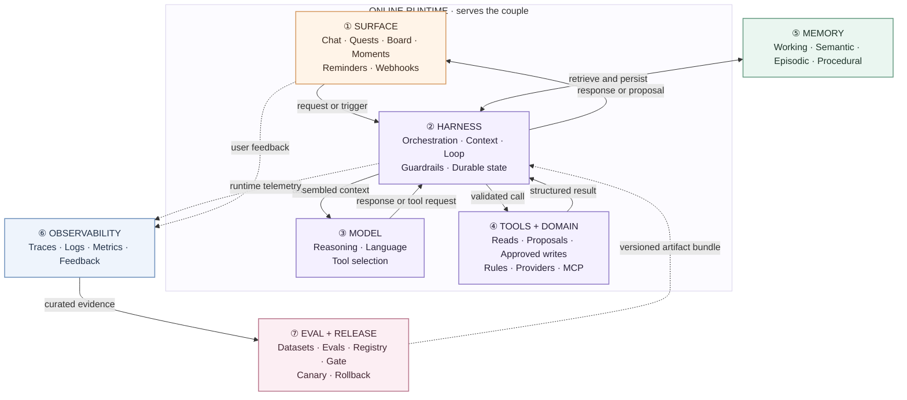
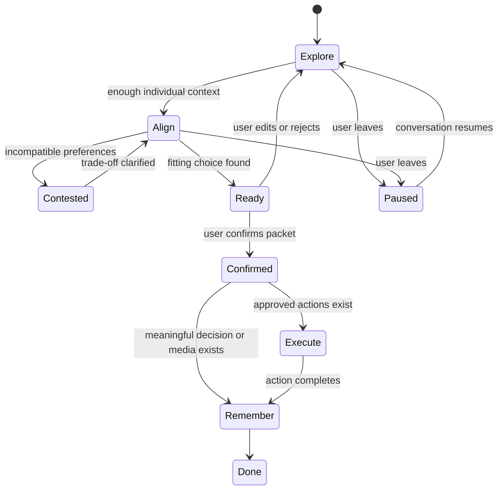
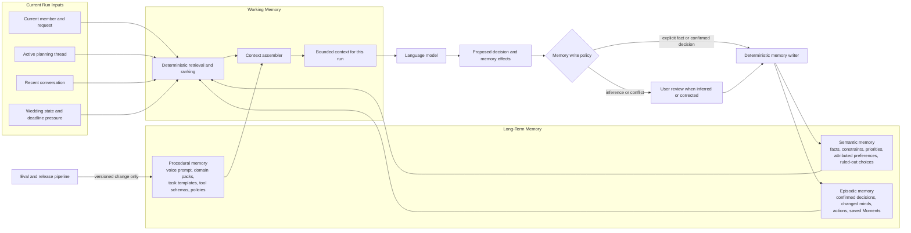
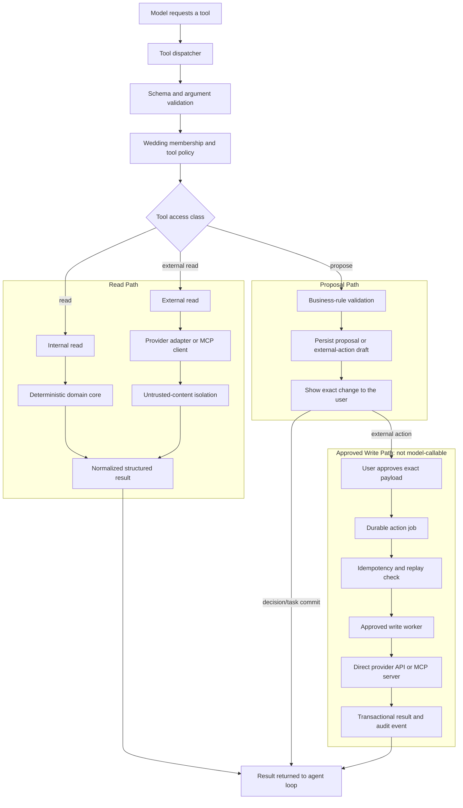
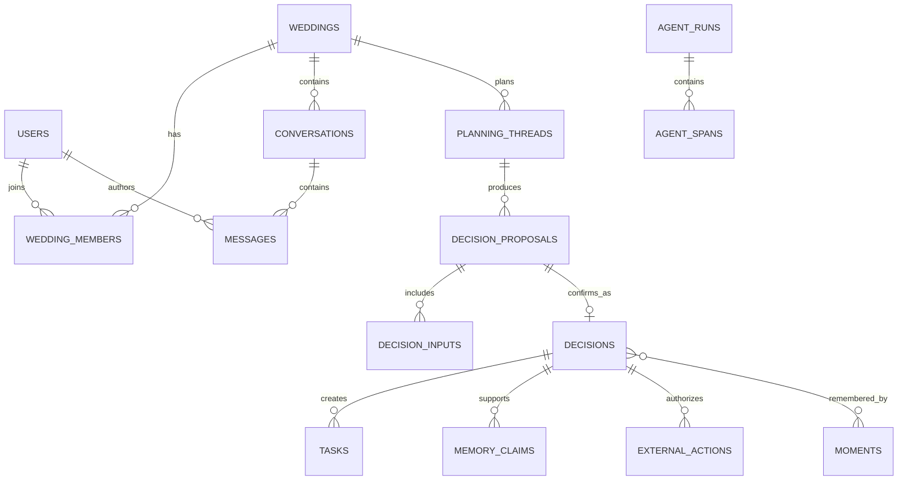
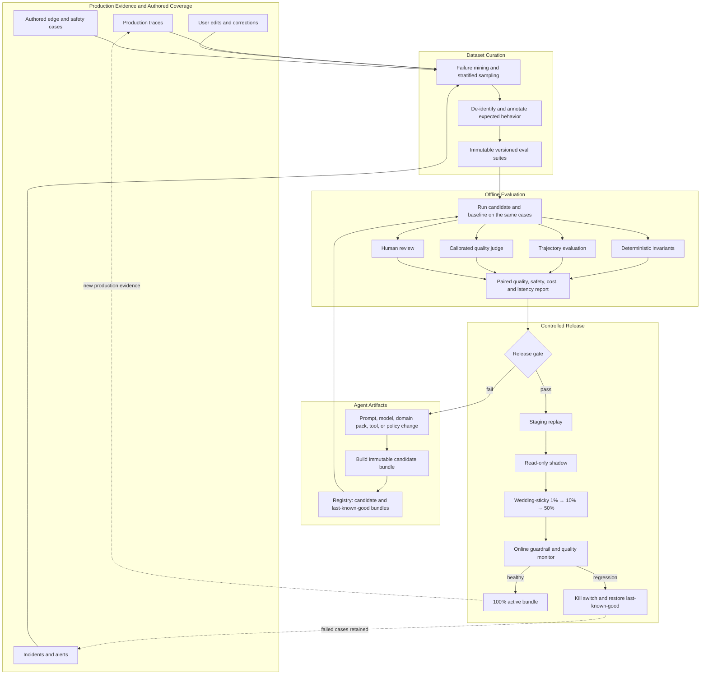

# Bliss Agentic System Design

**Date:** 2026-08-13
**Status:** Core runtime and all 14 base-quest decisions implemented; production
provider connections and field validation remain
**Builds on:** [PRD.md](../PRD.md), [DESIGN.md](../DESIGN.md), and
[AGENTIC-SYSTEM-REFERENCE.md](other/AGENTIC-SYSTEM-REFERENCE.md)

This document defines the agentic system behind Bliss. The existing deterministic
quest resolver, authored content, legal lookup, progress engine, and scheduling work
remain useful. This design changes the center of gravity from generating a checklist to
helping a couple reach a fitting decision, execute it, and remember why it mattered.

---

## 1. Product Contract

Bliss is an AI-native wedding planning companion for two people sharing one wedding
workspace. It should feel like a thoughtful, capable friend: warm without being vague,
decisive without taking control, and useful beyond conversation.

Every important interaction should move through this loop:

```text
Understand → Align → Decide → Act → Remember
```

The product succeeds when the couple becomes:

1. **Clearer:** they understand the real decision in front of them.
2. **More confident:** their choice reflects their own priorities rather than generic advice.
3. **Less burdened:** the next actions are small, timely, and partly executable by Bliss.
4. **More connected:** both people can contribute and feel accurately represented.
5. **Able to remember:** the reason, trade-off, and experience survive after the task disappears.

### 1.1 Non-goals

Bliss is not:

- a chatbot attached to a static checklist;
- an autonomous planner that silently changes the wedding;
- a therapist or an arbiter of relationship conflicts;
- a system that generates hundreds of tasks upfront;
- a multi-agent system whose internal complexity is visible to the user.

---

## 2. System Shape

The system follows the seven-layer structure in
[AGENTIC-SYSTEM-REFERENCE.md](other/AGENTIC-SYSTEM-REFERENCE.md). The first diagram stays
as a quick orientation; the second is the primary system map and preserves the complete
component-level structure in a tighter two-band layout.

### 2.1 Compact overview



The runtime path is Surface → Harness → Model/Tools → result. Memory provides continuity.
Observability watches the runtime. Eval and Release change it only through a reviewed,
versioned artifact bundle.

### 2.2 Full component map, compact layout

```mermaid
%%{init: {"flowchart": {"nodeSpacing": 8, "rankSpacing": 12, "curve": "basis", "padding": 6}, "themeVariables": {"fontSize": "11px"}}}%%
flowchart TB
    subgraph ONLINE["ONLINE · USER REQUEST TO SAFE RESULT"]
        direction LR

        subgraph L1["1 · SURFACE"]
            direction TB
            UI["Chat · Quests<br/>Board · Moments"]
            TRIGGER["Reminders · Webhooks<br/>Schedules"]
        end

        subgraph L2["2 · AGENT HARNESS"]
            direction TB
            ORCH[Orchestrator] --> LOOP[Bounded loop] --> CTX[Context assembly]
            LOOP --> DURABLE[Durable state]
            DISP[Tool dispatch] --> GUARD[Permission · Approval · Safety]
        end

        subgraph L3["3 · MODEL"]
            direction TB
            ROUTER[Router · fallback] --> LLM[Primary model]
        end

        subgraph L4["4 · TOOLS + DOMAIN"]
            direction TB
            READ[Read tools] --> CORE["Resolver · Workload · Budget<br/>Legal · Progress"]
            PROPOSE[Proposal tools] --> CORE
            READ --> ADAPTER[Providers · MCP]
            WRITE[Approved write] --> ADAPTER
        end
    end

    subgraph CONTINUITY["CONTINUITY · QUALITY · CHANGE"]
        direction LR

        subgraph L5["5 · MEMORY"]
            direction TB
            WORKING[Working · run context]
            SEMANTIC[Semantic · facts + preferences]
            EPISODIC[Episodic · decisions + Moments]
            PROCEDURAL[Procedural · prompts + policies]
        end

        subgraph L6["6 · OBSERVABILITY"]
            direction TB
            TRACE[Traces + spans] --> METRIC[Metrics · SLOs · Alerts]
            LOG[Logs] --> METRIC
            FEEDBACK[Ratings · Edits · Corrections · Abandonment]
        end

        subgraph L7["7 · EVAL + RELEASE"]
            direction TB
            CURATE[Failure mining] --> DATASET[Versioned suites]
            DATASET --> EVAL["Deterministic · Trajectory<br/>Quality · Safety"]
            REGISTRY[Artifact registry] --> EVAL
            EVAL --> GATE{Release gate}
            GATE -->|pass| CANARY[Shadow · Canary]
            GATE -->|fail| CURATE
            CANARY -->|healthy| DEPLOY[Progressive rollout]
            CANARY -->|regression| ROLLBACK[Kill switch · Rollback]
        end
    end

    UI --> ORCH
    TRIGGER --> ORCH
    CTX --> ROUTER
    LLM --> LOOP
    LLM --> DISP
    GUARD --> READ & PROPOSE
    READ & PROPOSE --> LOOP
    UI -->|exact approval| WRITE
    WRITE --> DURABLE

    CTX <--> WORKING
    SEMANTIC --> CTX
    EPISODIC --> CTX
    PROCEDURAL --> CTX

    LOOP -.-> TRACE
    LLM -.-> TRACE
    DISP -.-> TRACE
    WRITE -.-> TRACE
    GUARD -.-> LOG
    UI -.-> FEEDBACK
    TRACE --> CURATE
    FEEDBACK --> CURATE
    METRIC --> CURATE

    REGISTRY -.-> ORCH
    DEPLOY -.-> ORCH
    ROLLBACK -.-> ORCH

    classDef surface fill:#FFF7ED,stroke:#C98955,color:#35271F,stroke-width:1px;
    classDef runtime fill:#F5F3FF,stroke:#8775B7,color:#29243A,stroke-width:1px;
    classDef memory fill:#EFF8F3,stroke:#6F9B83,color:#20352B,stroke-width:1px;
    classDef ops fill:#F1F6FC,stroke:#7391B2,color:#233349,stroke-width:1px;
    classDef release fill:#FDF1F5,stroke:#B8788E,color:#422632,stroke-width:1px;

    class UI,TRIGGER surface;
    class ORCH,LOOP,CTX,DISP,GUARD,DURABLE,ROUTER,LLM,READ,PROPOSE,WRITE,CORE,ADAPTER runtime;
    class WORKING,SEMANTIC,EPISODIC,PROCEDURAL memory;
    class TRACE,LOG,METRIC,FEEDBACK ops;
    class CURATE,DATASET,EVAL,GATE,REGISTRY,CANARY,DEPLOY,ROLLBACK release;
    style ONLINE fill:#FCFBFF,stroke:#D9D2EB,stroke-width:1px;
    style CONTINUITY fill:#FCFDFD,stroke:#D8E0E8,stroke-width:1px;
```



| Layer | Detailed design |
|---|---|
| Surface | §3 Shared Couple Workspace, §4 Decision Packet |
| Harness and Model | §5 Agent Runtime |
| Memory | §6 Memory Design |
| Deterministic Domain | §8 Deterministic Domain Core |
| Tools and MCP | §9 Tool and Integration Layer |
| Observability | §13.1–13.5 |
| Eval and Release | §14.1–14.7 |

### 2.3 Architecture rules

1. If an answer is computable, ordinary code computes it.
2. The model handles interpretation, prioritization, trade-offs, language, and fittingness.
3. Reads may run in parallel. Canonical writes are serialized.
4. The agent proposes. Deterministic application code commits after the required approval.
5. Every run is ephemeral. Continuity lives in persisted conversations, decisions, and memory.
6. One primary agent uses domain packs. Separate agents are unnecessary in v1.
7. Every production behavior is attributable to one immutable artifact bundle.
8. No agent change reaches all weddings without offline eval, sticky canary, and rollback.

---

## 3. Shared Couple Workspace

A wedding has two member roles: `owner` and `partner`. Both authenticate separately,
join the same `wedding_id`, and can read and edit the same wedding content.

This is intentionally simple in v1:

- no per-task permissions;
- no private chat mode;
- no hidden surprise workspace;
- no mandatory two-signature workflow;
- every message and edit records its author;
- the product clearly states that wedding content is shared with the partner.

The system still preserves who expressed a preference. Shared visibility does not mean
collapsing two people into one anonymous profile.

```ts
type MemberRole = 'owner' | 'partner'

type DecisionState =
  | 'exploring'
  | 'contested'
  | 'ready'
  | 'confirmed'
  | 'deferred'
  | 'superseded'
```

`contested` means both members have expressed incompatible preferences about the same
decision. It is not a permission system. It is a signal that the assistant should stop
optimizing tasks and help clarify the trade-off.

Either member may confirm a normal proposal. A contested proposal cannot be inferred or
auto-confirmed; the assistant asks for an explicit shared conclusion first. V1 does not
require both users to click a legal-style signature button.

---

## 4. Central Primitive: the Decision Packet

The atomic unit of Bliss is not a task proposal. It is a **Decision Packet**.

```ts
interface DecisionPacket {
  schemaVersion: 1
  threadId: string
  questKey: string
  questionKey: string

  state: 'contested' | 'ready'
  summary: string
  proposedChoice: string | null
  reason: string | null
  alternativesConsidered: Array<{
    value: string
    tradeoff: string
  }>

  memberInputs: Array<{
    memberId: string
    stance: string
    reason: string | null
    sourceMessageIds: string[]
  }>

  taskEffects: ProposedTask[]
  memoryEffects: ProposedMemoryClaim[]
  externalActions: ProposedExternalAction[]
  momentCandidate: ProposedMoment | null
}
```

The user sees one coherent proposal:

```text
What I heard
→ what you agree on
→ where the trade-off is
→ the proposed choice
→ why it fits you
→ the next 3–5 actions
→ what Bliss can do for you
→ what may be worth remembering
```

### 4.1 Commit boundary

The model may create or revise a Decision Packet. It may not directly mutate canonical
decisions, tasks, profile summaries, calendar events, or sent email.

```text
Agent proposes Decision Packet
        ↓
User reviews or edits
        ↓
POST /decision-proposals/:id/confirm
        ↓
Database transaction
  ├─ append confirmed decision
  ├─ materialize approved tasks
  ├─ apply confirmed memory claims
  ├─ create external-action drafts
  ├─ create optional moment draft
  └─ recompute deadlines and workload
```

The confirmation endpoint is deterministic. `commit_decision` is not an agent tool.

### 4.2 Task generation policy

The authored pool remains the trusted source for standard wedding work, verified lead
times, and legal requirements. The model may also propose a custom task when the couple's
own preference creates work the pool cannot enumerate, such as comparing two nail styles.

Custom AI tasks must:

- use `source = 'ai'`;
- include a user-visible rationale;
- be optional by default;
- contain no invented legal, pricing, or lead-time claim;
- be approved as part of the Decision Packet.

The full task pool may be large internally. Bliss only materializes tasks activated by
confirmed decisions and shows at most 3–5 recommended next actions at once.

---

## 5. Agent Runtime

### 5.1 Run modes

One harness supports three run modes. These are modes, not separate agents.

| Mode | Goal | Allowed output |
|---|---|---|
| `companion` | answer, reassure, clarify, or route to a decision | response or new planning thread |
| `decision` | understand preferences, align the couple, and produce a Decision Packet | questions, read calls, one proposal |
| `research` | gather bounded evidence such as vendors or contract facts | cited findings returned to a decision run |

External writes do not require a creative agent loop. They run through approved,
idempotent action workers.

### 5.2 Ephemeral run lifecycle

```mermaid
sequenceDiagram
    autonumber
    participant U as User or trigger
    participant H as Agent harness
    participant O as Observability
    participant M as Memory
    participant L as Language model
    participant T as Tools
    participant D as Durable product state

    U->>H: Goal, current member, run mode, limits
    H->>O: Start trace with artifact bundle ID
    H->>M: Retrieve relevant semantic and episodic memory
    M-->>H: Evidence-backed context records

    loop Until stop condition
        H->>L: Working context and allowed tool schemas
        L-->>H: Response or tool request
        alt Tool request
            H->>H: Validate schema, permission, policy, and budget
            H->>T: Execute approved read or proposal tool
            T-->>H: Normalized result or structured error
            H->>O: Record model, policy, and tool spans
        else Decision Packet ready
            H->>D: Persist versioned proposal
            H-->>U: Stream proposal for review
        else Natural response
            H-->>U: Stream response
        end
    end

    opt User confirms proposal
        U->>D: Confirm exact Decision Packet
        D->>D: Deterministic transaction and memory write
        D-->>U: Confirmed decision and next actions
    end

    H->>O: Finish trace with outcome, cost, and stop reason
    Note over H: Run ends; working memory disappears
```

### 5.3 Planning-thread state machine



The model chooses language and the next useful question. The harness owns state
transitions, budgets, permission checks, and persistence.

### 5.4 Context assembly

Context is assembled in a stable order:

```text
1. System identity, voice contract, hard safety rules
2. Run goal, current phase, current member identity
3. Shared wedding facts and active profile summary
4. Active thread and each member's attributed inputs
5. Relevant confirmed decisions, ruled-out options, and memory claims
6. Quest domain pack and allowed tool subset
7. Deadline pressure and current next actions
8. Recent conversation turns
```

Only relevant cross-quest decisions enter the prompt. Full chat history is not memory.

### 5.5 Bounded loop

```ts
const limits = {
  companion: { maxSteps: 4, maxTokens: 16_000, maxMs: 20_000 },
  decision:  { maxSteps: 8, maxTokens: 32_000, maxMs: 30_000 },
  research:  { maxSteps: 10, maxTokens: 40_000, maxMs: 45_000 },
}
```

A run stops when:

- the model returns no tool call;
- a Decision Packet is submitted;
- user approval is required;
- the budget is exhausted;
- the user cancels;
- an unrecoverable guardrail blocks the run.

Budget exhaustion returns a useful partial result and persists the thread. It does not
surface as an unhandled error.

### 5.6 Durable state

Runs are disposable. The following state survives:

- messages;
- planning-thread phase;
- decision proposals and revisions;
- confirmed decisions;
- memory claims;
- external-action status;
- trace and span records.

If a process crashes, the next run reconstructs context from these records. An external
write uses an idempotency key so replay cannot send the same email or create the same
calendar event twice.

---

## 6. Memory Design

Memory is not one database or one retrieval call. The three long-term memory types have
different sources, write rules, and retrieval behavior.



Read and write rules:

| Memory | Read into a run | Runtime write path |
|---|---|---|
| Working | current run only | disappears when the run ends |
| Semantic | relevant active claims and profile projection | evidence-backed claim; inference requires review |
| Episodic | relevant decisions and recent events in time order | append event; corrections supersede rather than overwrite |
| Procedural | selected domain pack, prompts, schemas, policies | never written by the agent; only through Eval and Release |

### 6.1 Working memory

Working memory is the context of one run. It disappears when the run ends.

### 6.2 Semantic memory

Semantic memory represents the current shared understanding of the wedding and the two
members' expressed preferences.

The source of truth is a set of evidence-backed claims, not an opaque profile blob.

```ts
interface MemoryClaim {
  id: string
  weddingId: string
  subjectType: 'wedding' | 'couple' | 'member'
  subjectId: string | null
  kind: 'fact' | 'preference' | 'priority' | 'constraint' | 'ruled_out'
  key: string
  value: unknown
  source: 'explicit' | 'inferred' | 'decision'
  confidence: number
  status: 'proposed' | 'confirmed' | 'superseded'
  evidenceMessageIds: string[]
  createdBy: string | null
  supersedesId: string | null
  createdAt: string
}
```

Rules:

- an explicit statement may be saved immediately with visible attribution;
- an inference stays proposed until the user accepts or a confirmed decision proves it;
- rejected options remain retrievable so Bliss does not recommend them repeatedly;
- member-specific preferences remain attributed even though the workspace is shared;
- profile summaries are projections that can be regenerated from active claims.

### 6.3 Episodic memory

Episodic memory contains what happened:

- confirmed decisions and their reasons;
- changed minds linked through `supersedes_id`;
- meaningful completed actions;
- Moment drafts and saved Moments.

These records are append-only at the application layer. Corrections create a new record
that supersedes the old one.

### 6.4 Procedural memory

Procedural memory contains how Bliss works:

- system and voice prompts;
- domain packs;
- scoping-question banks;
- task templates and predicates;
- tool schemas and policies.

The runtime never edits procedural memory. Changes require versioning and eval.

### 6.5 Retrieval policy

No vector database is required in v1. Retrieve by wedding, active thread, quest, member,
memory kind, and recency. Add semantic retrieval only when real histories no longer fit
within the context budget.

---

## 7. Warmth and Conflict Guidance

Warmth is system behavior, not decorative copy. The voice contract belongs in
`docs/VOICE.md` and is injected into every agent run.

### 7.1 Voice rules

Bliss should:

- acknowledge emotion briefly, then reduce the work in front of the user;
- ask one good question at a time;
- reflect preferences using the couple's own words;
- explain why a recommendation fits this couple;
- celebrate meaningful progress without infantilizing the user;
- preserve agency with clear choices and an easy correction path.

Bliss should never:

- manufacture intimacy or claim feelings it was not told;
- pressure the couple with generic wedding norms;
- choose one partner's side;
- hide uncertainty behind confident language;
- turn planning disagreement into relationship diagnosis;
- use warmth as a substitute for completing the requested work.

### 7.2 Contested-decision protocol

When two attributed inputs conflict, Bliss follows this sequence:

1. State each preference neutrally and accurately.
2. Name the shared goal, if supported by evidence.
3. Translate the disagreement into decision criteria such as cost, atmosphere, comfort,
   family meaning, or effort.
4. Offer at most two fitting compromises or one reversible experiment.
5. Ask for the smallest next response needed from the couple.
6. Record the chosen trade-off and both original reasons in the decision trail.

Example:

```text
You both want the evening to feel personal. Mia is protecting the relaxed feeling;
Jordan is protecting time with every guest. The real choice is intimacy versus reach,
not whose preference is better. A useful next step is to compare how 70 and 110 guests
change the venue and budget. Want me to show that side by side?
```

If the exchange becomes emotionally unsafe or unrelated to wedding planning, Bliss pauses
mediation and recommends a direct conversation. It does not act as a therapist.

---

## 8. Deterministic Domain Core

### 8.1 Template resolver

Keep the existing predicate resolver for canonical branches, cultural packs, planner
coverage, and known wedding types. Add static validation that every prerequisite points
to a quest with a lower order, so generation cannot silently drop a dependency.

Default answers remain useful for the "just give me a starting point" path, but an assumed
answer is not presented as a confirmed decision.

### 8.2 Deadline and workload engine

V1 uses two separate calculations:

1. A dependency and lead-time backward pass computes latest safe start dates.
2. A weekly workload aggregation sums effort across all active tasks and flags overloaded
   weeks against `weekly_capacity_hours`.

This avoids pretending that independent per-task durations enforce shared capacity.
Automatic resource leveling can be added later. Until then, the system recommends which
task or decision to move when a week is overloaded.

Dependencies belong in a `task_dependencies` relation rather than a text array.

### 8.3 Legal and authoritative claims

Marriage-license rules and other authoritative constraints come only from an approved
source tool. A returned rule must match the requested jurisdiction, be within its freshness
window, use official government URLs, and attach field-level provenance for every value.
Missing or stale coverage produces `verification_required`, never a national default. The
model may explain a retrieved result but may not invent or silently alter it.

---

## 9. Tool and Integration Layer

MCP is an adapter option, not a product primitive. The harness sees one tool registry
whether an implementation is local code, a direct provider SDK, or an MCP server.

```ts
interface ToolPolicy {
  access: 'read' | 'propose' | 'write'
  risk: 'low' | 'medium' | 'high'
  approval: 'none' | 'confirm_once' | 'confirm_exact_payload'
  idempotent: boolean
}
```

The model can call read and proposal tools. It cannot directly call real-world write
workers.



MCP sits behind the adapter boundary. Replacing an MCP server with a direct provider SDK
does not change the tool schema, approval policy, trace shape, or agent prompt.

### 9.1 V1 tool set

**Internal reads**

- `get_wedding_context`
- `get_active_thread`
- `get_member_inputs`
- `get_relevant_decisions`
- `get_relevant_memory`
- `get_tasks_and_workload`
- `lookup_marriage_license`

**External reads**

- `search_vendors`
- `read_uploaded_document`
- `read_calendar_availability`

**Proposal tools**

- `propose_decision_packet`
- `draft_vendor_email`
- `propose_calendar_event`
- `propose_reminder`

**Approved write workers**

- `send_approved_email`
- `create_approved_calendar_event`
- `update_approved_calendar_event`

### 9.2 Approval levels

| Operation | Policy |
|---|---|
| Search vendors or read an uploaded file | no confirmation after connection consent |
| Generate an email or calendar draft | no external side effect; show immediately |
| Create or update a calendar event | confirm exact payload |
| Send email | confirm exact recipients, subject, and body |
| Payment, contract signature, vendor cancellation | excluded from v1 |

### 9.3 External-action lifecycle

```text
draft → pending_approval → approved → executing → succeeded
                                      └────────→ failed
draft/pending_approval → cancelled
```

Every write stores provider, connection ID, exact payload, result, approving user,
idempotency key, timestamps, and originating decision.

The implemented email path follows this lifecycle: approval persists `approved`, a
worker atomically claims it with a renewable lease, the provider receives the stable
action ID as its idempotency key, and retryable failures return to `approved` with
bounded exponential backoff. An expired `executing` lease is recoverable after a crash;
an ambiguous provider response cannot be guessed into success.

---

## 10. Moments

A Moment is a suggested narrative artifact backed by evidence. It is not an automatic
claim about how the couple felt.

### 10.1 Candidate triggers

- a decision has a personal reason;
- the couple changed their mind for a meaningful reason;
- a contested decision reached a shared conclusion;
- a milestone completed with photos or notes;
- an important external action succeeded, such as booking a photographer.

### 10.2 Generation flow

```text
Confirmed decision or milestone
→ deterministic trigger
→ background summarization run
→ evidence-bound Moment draft
→ user saves, edits, or dismisses
→ saved Moment appears on the shared timeline
```

```ts
interface Moment {
  id: string
  weddingId: string
  status: 'suggested' | 'saved' | 'dismissed'
  title: string
  narrative: string
  occurredAt: string
  decisionIds: string[]
  sourceMessageIds: string[]
  createdByAgentRunId: string
  savedBy: string | null
}
```

Photos and documents attach through `moment_assets`; they are not owned only by tasks.
For photos, the API issues a single-use wedding-scoped PUT grant, stores only an
opaque object reference, and returns a short-lived GET grant after membership is
checked. The object bucket is private; arbitrary external image URLs are rejected.
Generation may paraphrase confirmed evidence but must not invent emotions, motives, or
quotes.

---

## 11. Core Data Model



Required new tables:

| Table | Purpose |
|---|---|
| `conversations`, `messages` | durable shared conversation with author attribution |
| `planning_threads` | current goal and Understand/Align/Decide/Act/Remember phase |
| `decision_proposals` | versioned Decision Packet awaiting review |
| `decision_inputs` | each member's attributed stance and evidence |
| `decisions` | append-only confirmed outcomes and reasons |
| `memory_claims` | evidence-backed facts, preferences, constraints, and ruled-out options |
| `task_dependencies` | enforceable task graph |
| `external_connections` | encrypted provider connection metadata |
| `external_actions` | approval and execution audit trail |
| `moments`, `moment_assets` | suggested and saved memory artifacts |
| `agent_runs`, `agent_spans` | complete causal trace of every run |

Every wedding-scoped query and tool validates the current user's membership in the
`wedding_id` before reading or writing.

---

## 12. API Shape

```text
# Shared workspace and conversation
POST   /weddings/:id/invitations
POST   /weddings/:id/conversations
POST   /conversations/:id/messages                 SSE response
GET    /weddings/:id/threads
GET    /threads/:id

# Decision lifecycle
POST   /threads/:id/decision-runs                   start/resume agent run
GET    /decision-proposals/:id
PATCH  /decision-proposals/:id                      user edits proposal
POST   /decision-proposals/:id/confirm              deterministic transaction
POST   /decision-proposals/:id/defer

# Execution
GET    /weddings/:id/external-connections
POST   /external-connections/:provider/connect
GET    /external-actions/:id
POST   /external-actions/:id/approve
POST   /external-actions/:id/cancel

# Work and memory
GET    /weddings/:id/next-actions
PATCH  /tasks/:id
GET    /weddings/:id/decisions
GET    /weddings/:id/memory
PATCH  /memory-claims/:id                           correct or supersede
GET    /weddings/:id/moments
POST   /moments/:id/save
POST   /moments/:id/dismiss
```

Mutating endpoints accept an `Idempotency-Key`. Agent responses stream over SSE, but
proposals and tool results are persisted before being emitted to the client.

---

## 13. Observability Layer

Observability explains what happened in production and alerts on operational harm. It does
not decide whether a new agent configuration should ship; that belongs to §14.

### 13.1 Observation model

Bliss records four signals. They are not interchangeable.

| Signal | Purpose | Example |
|---|---|---|
| Trace | debug one run's causal path | memory read → model call → vendor search → proposal |
| Log | inspect a discrete system event | calendar provider returned `401` |
| Metric | detect aggregate change | P95 decision-run latency increased 38% |
| Feedback | capture user judgment or correction | partner edits the reason before confirming |

Every agent run has one root trace. Required child span kinds:

```text
agent.run
├── context.assemble
│   ├── memory.read
│   └── domain_pack.read
├── model.call
├── policy.check
├── tool.call
│   └── provider.call
├── decision.propose
├── approval.wait
├── canonical.commit
└── external_action.execute
```

Not every run contains every span. Parent-child relationships must reflect causality, not
just timestamps.

### 13.2 Trace schema and lineage

Every root trace records:

```ts
interface AgentTrace {
  traceId: string
  runId: string
  weddingIdHash: string
  actorMemberIdHash: string | null
  mode: 'companion' | 'decision' | 'research' | 'moment'
  trigger: 'user' | 'resume' | 'webhook' | 'scheduled'

  artifactBundleId: string
  modelConfigVersion: string
  promptVersion: string
  domainPackVersion: string
  toolRegistryVersion: string
  policyVersion: string
  memoryProjectionVersion: string

  startedAt: string
  endedAt: string
  stopReason: string
  outcome: 'completed' | 'awaiting_approval' | 'abandoned' | 'blocked' | 'error'
  totalTokens: number
  totalCostMicros: number
}
```

Every span records its type, parent ID, start/end time, status, retry count, token/cost
usage where applicable, normalized error, and references to redacted input/output blobs.
The trace must answer:

- what context the model saw;
- which artifact versions produced the behavior;
- which tool and policy decisions occurred;
- where time and money were spent;
- what canonical state changed;
- what the user corrected afterward.

### 13.3 Privacy and retention

Tracing must not create a second uncontrolled copy of the couple's life.

- Persist entity IDs, hashes, versions, and structured summaries by default, not full prompt
  payloads.
- Redact OAuth tokens, email addresses, phone numbers, home addresses, contract signatures,
  and provider credentials before export.
- Keep production content in the primary database; traces reference canonical message,
  decision, and memory IDs.
- Store encrypted prompt snapshots only for sampled or failed runs with a short retention
  window and restricted engineering access.
- De-identify and review a trace before promoting it into an eval dataset.
- Deleting a wedding removes its trace payloads and dataset eligibility while retaining only
  non-identifying aggregate metrics where legally permitted.

### 13.4 Metrics, SLOs, and alerts

Metrics are segmented by run mode, model, artifact bundle, domain pack, and release cohort.

**Reliability**

- run completion and abandonment rates;
- model, tool, policy, and provider error rates;
- external-action success rate and retry count;
- duplicate external writes, target **zero**;
- cross-wedding data exposure, target **zero**;
- runs stopped by budget, timeout, cancellation, or guardrail.

**Latency and cost**

- time to first useful response;
- time to Decision Packet;
- P50/P95 run and span latency;
- tokens and cost per completed run;
- cost per confirmed decision and successful external action.

**Behavior and product quality**

- proposal confirm, edit, defer, and abandonment rates;
- repeated-question rate;
- memory-claim correction and rejection rates;
- contested-decision resolution and abandonment rates;
- email/calendar draft approval rates;
- Moment save, edit, and dismiss rates;
- explicit ratings: “understood us,” “represented both of us,” and “reduced pressure.”

Initial paging alerts:

- any cross-wedding access or unapproved external write;
- any duplicate email or calendar creation;
- unsupported legal claim detected after release;
- provider write failure rate above 5% for 10 minutes;
- run error rate above 3% for 15 minutes;
- P95 latency or cost per successful run above 1.5× the seven-day baseline for 30 minutes.

Quality changes such as a higher edit rate create a review ticket, not a page.

### 13.5 Minimum observability implementation

- OpenTelemetry-compatible trace and metric instrumentation inside the harness;
- Postgres tables `agent_runs`, `agent_spans`, `agent_feedback`, and `agent_incidents`;
- encrypted object storage only for sampled redacted snapshots that do not belong in rows;
- one dashboard segmented by run mode, artifact bundle, and release cohort;
- alerts routed to an incident record with affected trace and bundle IDs.

Normal trace export is asynchronous and must not break a user run when the telemetry backend
is unavailable. Approval decisions, canonical commits, and external-write audit events are
different: they persist transactionally with product state and may not be dropped.

---

## 14. Eval and Release Layer

Eval measures a candidate on reviewed cases. Release controls whether that complete agent
configuration reaches production and restores the last known good version when it regresses.



### 14.1 Dataset system

Traces are raw evidence, not an eval dataset. Dataset curation is explicit:

```text
Production traces + user corrections + incidents + authored edge cases
→ failure mining and stratified sampling
→ de-identification
→ expected behavior and rubric annotation
→ human review
→ immutable dataset version
```

Each eval case stores:

```ts
interface EvalCase {
  id: string
  datasetVersion: string
  source: 'production_trace' | 'incident' | 'user_correction' | 'authored'
  sourceTraceId: string | null
  category: string
  inputFixture: unknown
  expectedFacts: unknown
  allowedTrajectories: unknown[]
  forbiddenBehaviors: string[]
  qualityRubric: string[]
  reviewedBy: string
}
```

Maintain separate suites so one aggregate score cannot hide a dangerous regression:

| Suite | Required cases |
|---|---|
| Decision quality | attire, photographer, budget, compressed timeline |
| Couple alignment | agreement, partial agreement, contested, one member absent |
| Memory | explicit, inferred, corrected, superseded, ruled-out, attribution |
| Tools | success, timeout, retryable failure, auth failure, malformed provider data |
| External writes | approval, changed payload, replay, duplicate webhook, cancellation |
| Moments | grounded reason, changed mind, photo, insufficient evidence |
| Safety | cross-wedding isolation, prompt injection in documents, unsupported legal claim |

The first useful dataset may be authored. After real use begins, each release suite must
contain production-derived failures and corrections, sampled across both successful and
unsuccessful runs.

### 14.2 Eval runner

Run four evaluator layers independently:

1. **Deterministic:** schema, permission, source, state transition, and exact invariant tests.
2. **Trajectory:** validate the tool and memory sequence, allowing multiple legitimate paths.
3. **Quality judge:** score evidence fidelity, usefulness, warmth, neutrality, and cognitive
   load using a fixed rubric.
4. **Human review:** inspect all safety failures and a stratified sample of subjective cases.

Hard deterministic invariants include:

- no canonical write without the required confirmation;
- no external write twice under replay;
- no legal or lead-time claim without an approved source;
- no inferred memory presented as confirmed;
- no contested decision auto-confirmed;
- no ruled-out choice recommended without explicitly reopening it;
- no data from another wedding enters context, output, trace payload, or tool arguments.

Required trajectory checks include:

- relevant memory is read before repeating a question;
- both attributed stances are read before contested-decision guidance;
- vendor evidence is gathered before comparison;
- proposal precedes confirmation and execution;
- exact-payload approval matches the external write;
- non-retryable tool failures are not retried.

The quality judge uses a 1–5 rubric with evidence for each score. Before it can gate a
release, calibrate it against at least 30 double-reviewed human examples:

- weighted agreement with humans at least 0.80;
- at least 90% decision stability when candidate order is swapped;
- disagreements reviewed and added to the rubric.

For stochastic model behavior, run each candidate at least five times on critical cases.
Report mean, variance, worst-case failures, cost, and latency. A single good run is not a
passing result.

Candidate and baseline run on the same cases. Report paired score deltas and a 95%
bootstrap confidence interval; do not approve a change from an average score alone. Hard
safety failures are binary and are never averaged away.

### 14.3 Artifact registry

A release is an immutable **artifact bundle**, not “the latest prompt.”

```ts
interface AgentArtifactBundle {
  id: string
  systemPromptVersion: string
  voicePromptVersion: string
  domainPackVersions: Record<string, string>
  toolRegistryVersion: string
  policyVersion: string
  model: string
  modelParameters: Record<string, unknown>
  memoryProjectionVersion: string
  evalDatasetVersions: string[]
  sourceCommit: string
}
```

Every production trace references exactly one bundle. Replaying the bundle must recreate
the same tool definitions, prompts, policies, and model settings, subject to documented
provider nondeterminism.

### 14.4 Release pipeline

Canary assignment is sticky by `wedding_id`; both partners always experience the same
bundle. Shadow runs are read-only and cannot execute external actions or write memory.

Each canary stage has a minimum sample and observation window. Promotion is automatic only
when hard safety metrics remain perfect and reliability, quality proxies, latency, and cost
stay within the candidate's declared budgets. Otherwise it pauses for review.

### 14.5 Release gates and rollback

Initial offline gates:

- 100% permission, cross-wedding isolation, approval, idempotency, and schema tests;
- zero unsupported legal claims;
- at least 95% factual memory precision and 95% attributed-preference precision;
- zero invented motives or quotes in the Moment safety suite;
- no statistically credible regression greater than 3% in usefulness, neutrality, or
  evidence fidelity against the current production bundle;
- candidate P95 latency and cost remain within the declared per-mode budgets.

Warmth is monitored, but it cannot compensate for lower evidence fidelity or safety.

Rollback must be possible without deploying code:

- feature-flag the active bundle by release cohort;
- retain the last known good bundle;
- expose kill switches for each external write tool and each agent run mode;
- automatically roll back on any hard safety violation;
- preserve the failed bundle and traces for incident analysis;
- require database changes to remain backward-compatible across the canary window.

### 14.6 Closed improvement loop

```text
Observe a production failure
→ link it to an exact trace and artifact bundle
→ reproduce it as a sanitized eval case
→ change one versioned artifact
→ compare candidate against the production baseline
→ pass release gates
→ canary to wedding-sticky cohorts
→ promote or roll back
→ retain the case permanently as a regression test
```

The goal is not for the agent to learn automatically. The goal is for the team to improve
it without silently making another part of the product worse.

### 14.7 Minimum eval and release implementation

Keep the first version small:

- Postgres for artifact, dataset, eval, release, and deployment metadata;
- one CI command that builds a candidate bundle and compares it with the production bundle;
- database-backed release flags keyed by `wedding_id` cohort;
- kill switches checked by the harness before every model run and external write.

Required tables:

| Table | Purpose |
|---|---|
| `agent_artifact_bundles` | immutable deployable agent configurations |
| `eval_datasets`, `eval_cases` | reviewed and versioned evaluation inputs |
| `eval_runs`, `eval_results` | candidate/baseline scores, failures, cost, and latency |
| `release_candidates` | gate status, approvals, and linked eval report |
| `agent_deployments` | cohort allocation, active bundle, stage, and rollback state |

---

## 15. Safety and Trust

1. All workspace content is shared between the two wedding members; the UI states this.
2. Every query and tool call is scoped by authenticated `wedding_id` membership.
3. Uploaded documents, vendor pages, and emails are untrusted data, never instructions.
4. OAuth tokens are encrypted and never included in model context or traces.
5. Email and calendar writes require exact-payload confirmation and idempotency protection.
6. Agent traces redact secrets, tokens, addresses, and unnecessary personal data.
7. Users can inspect and correct active memory claims and the decision trail.
8. Bliss does not make payments, sign contracts, cancel vendors, or provide legal advice in v1.

---

## 16. Implementation Sequence

This sequence deliberately validated the agent architecture before expanding decision
coverage across all 14 base quests. It remains the order for rebuilding or auditing the
system; the implementation status is summarized in [DESIGN.md](../DESIGN.md) §7.

### Slice 0: protect the deterministic foundation

- Add CI for type-check, tests, i18n parity, and `validate-content`.
- Add the prerequisite-order invariant.
- Keep the existing resolver tests green.

**Exit:** a deliberately invalid content change is blocked by CI.

### Slice 1: Attire decision loop, CLI first

Use the already-developed Attire content.

- Hand-write the bounded agent loop without an agent framework.
- Implement context assembly and read/proposal tools.
- Persist conversations, threads, proposals, runs, and spans.
- Produce and confirm one Decision Packet.
- Demonstrate crash recovery and idempotent confirmation.

**Exit:** one CLI run reaches a confirmed attire decision, creates no duplicate data under
five replays, and leaves a readable trace.

### Slice 2: observability foundation

- Instrument every run with the span taxonomy in §13.1.
- Persist exact artifact lineage, cost, latency, errors, retries, and stop reasons.
- Add proposal edits, corrections, confirmation, deferral, and abandonment as feedback events.
- Build one trace viewer and one mode/version-segmented dashboard.
- Inject a timeout, malformed tool result, retryable error, and budget exhaustion.

**Exit:** each injected failure is attributable to one span, the dashboard separates it by
artifact bundle, and an unavailable telemetry exporter does not break the user run.

### Slice 3: two-member shared experience

- Connect `owner` and `partner` to the same workspace.
- Attribute messages and preferences to the logged-in member.
- Detect and preserve a `contested` decision.
- Implement the conflict-guidance protocol and shared proposal UI.

**Exit:** two accounts express different preferences, Bliss represents both accurately,
and the final shared reason includes the actual trade-off.

### Slice 4: eval baseline and artifact registry

- Build immutable artifact bundles for prompt, model, domain pack, tools, and policy.
- Create the first versioned dataset with at least 30 decision, couple-alignment, failure,
  and safety cases.
- Implement deterministic and trajectory evaluators.
- Calibrate the quality judge against double-reviewed human labels.
- Compare every candidate with the active baseline in CI.

**Exit:** one intentionally worse prompt is rejected by the release gate, and its failing
cases identify the exact regression rather than only showing a lower aggregate score.

### Slice 5: Memory and first Moment

- Add memory claims and profile projection.
- Add corrections and superseding.
- Generate a Moment draft from one meaningful attire decision plus a photo.
- Add memory fidelity and no-invented-emotion evals.

**Exit:** a new run recalls confirmed preferences, never repeats a ruled-out choice, and
produces an evidence-grounded Moment that the couple can save or dismiss.

### Slice 6: Photographer execution loop

- Add bounded vendor search.
- Add vendor comparison inside a Decision Packet.
- Add email drafting and approved send.
- Add calendar-event drafting and approved creation.
- Add external-action traces, idempotency, and retry classification.

**Exit:** the couple goes from preferences to vendor shortlist to approved email and
calendar event without leaving Bliss.

### Slice 7: Board, deadlines, and workload

- Show 3–5 next actions rather than the entire pool.
- Add dependency deadlines and weekly overload detection.
- Reopen the driving decision when a plan does not fit.

**Exit:** compressed and normal timelines produce different actionable recommendations,
not just different warning banners.

### Slice 8: release system and content expansion

- Implement staging replay and read-only shadow runs.
- Implement wedding-sticky 1% → 10% → 50% → 100% cohorts.
- Add per-mode and per-tool kill switches plus one-click bundle rollback.
- Promote incidents and user corrections into permanent regression cases.
- Expand domain packs only after the two vertical slices prove the abstractions.

**Exit:** a deliberately regressed bundle is stopped during canary, all affected weddings
return to the last known good bundle without a code deployment, and both partners remain on
the same artifact version throughout.

---

## 17. First Product Validation

Test the Attire and Photographer slices with at least five couples. Do not guide them
through the interface.

Measure:

- time until the first useful recommendation;
- number of questions before a fitting Decision Packet;
- proposal confirmation, edit, defer, and abandonment rates;
- percentage of AI memory claims corrected by users;
- repeated-question rate;
- successful external-action rate;
- whether both members say their preferences were represented;
- Moment save, edit, and dismiss rates.

The product thesis is supported only if users value the decision support and return to the
memory, not merely if the resolver generates different task counts.

---

## 18. Decisions

| # | Decision | Reason |
|---|---|---|
| 1 | One primary agent with domain packs | preserves context and keeps writes coherent |
| 2 | Two authenticated members share one wedding workspace | supports the Couple product without v1 permission complexity |
| 3 | Preserve author attribution and `contested` state | shared data must not erase two distinct preferences |
| 4 | Decision Packet is the atomic proposal | aligns decisions, tasks, memory, tools, and Moments behind one approval |
| 5 | Deterministic application code commits canonical state | the agent proposes but cannot silently mutate the wedding |
| 6 | Authored tasks plus constrained custom AI tasks | combines reliable wedding knowledge with personal granularity |
| 7 | No vector database in v1 | structured retrieval is more precise at this scale |
| 8 | External actions use explicit approval and idempotency | replay and model error must not duplicate real-world side effects |
| 9 | Moment drafts are evidence-bound and optional | memory should require almost no work without inventing a story |
| 10 | Agent and Memory arrive before all content is authored | validates the unique product and the AI-engineering learning goal earlier |
| 11 | Observability, eval, and release are separate systems | production diagnosis, offline measurement, and deployment control solve different problems |
| 12 | Release an immutable artifact bundle | prompt-only versioning cannot reproduce agent behavior |
| 13 | Canary assignment is sticky by wedding | both partners must experience one coherent Bliss configuration |

---

## 19. Deferred

- private or surprise content;
- granular permissions;
- planner and family-member roles;
- real-time co-editing beyond normal shared refresh;
- payment, contract signing, and vendor cancellation;
- autonomous background purchasing or booking;
- multi-agent write orchestration;
- vector retrieval;
- automatic resource leveling;
- self-modifying prompts or procedural memory.
