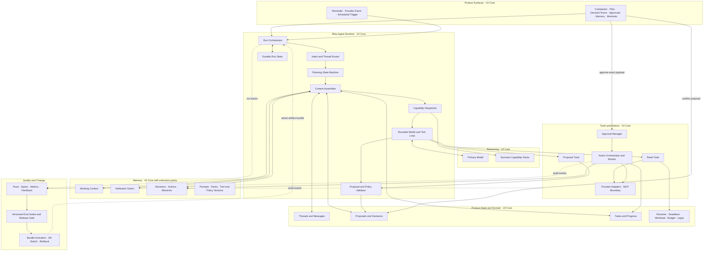
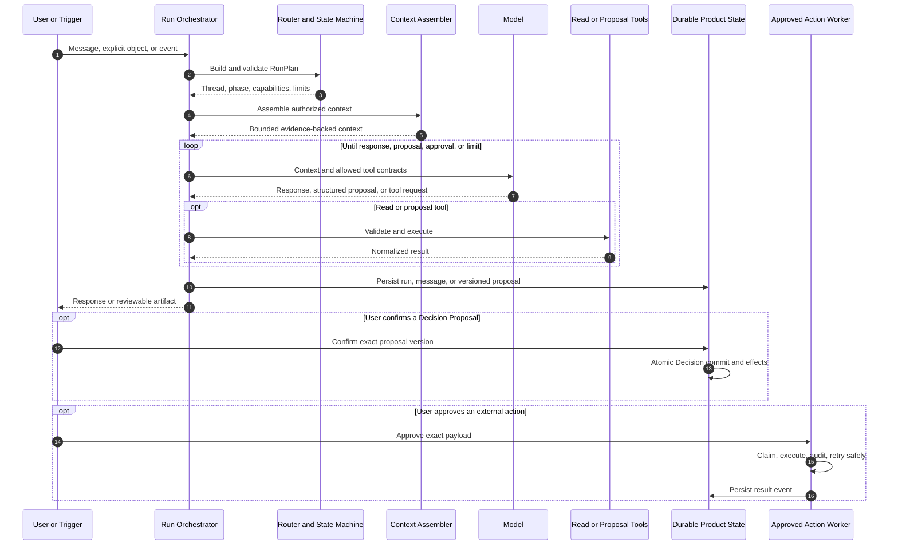
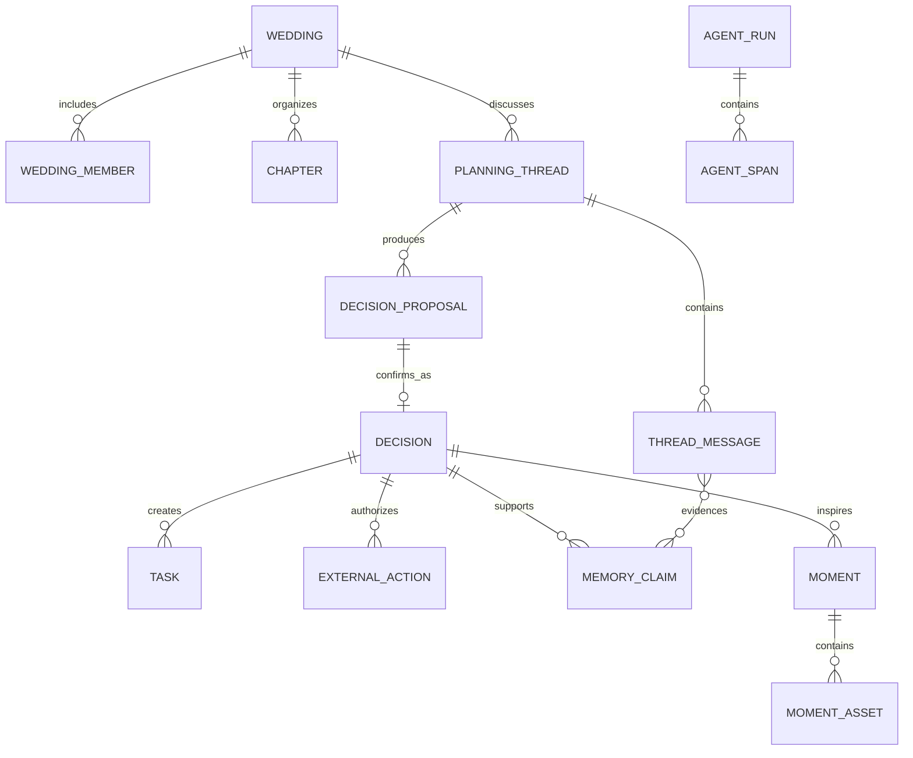

# Bliss Agentic Product System Design — V2

**Status:** Implementable product architecture with explicit extension points

**Version:** 2.1

**Primary validation journey:** Choosing and booking a wedding photographer

## 0. Relationship to V1

V2 does not remove the system responsibilities defined in V1. It preserves the complete capability map and changes three things:

1. Product behavior, orchestration, and key user journeys are the organizing structure.
2. Every capability is assigned an implementation depth instead of being treated as equally urgent.
3. The first release proves one complete journey before infrastructure and domain coverage expand.

V2 uses three scope labels:

| Label | Meaning |
|---|---|
| **V2 Core** | Required to complete the first trustworthy product journey |
| **Extension Point** | The boundary and contract are preserved; implementation may be minimal or deferred |
| **Later** | A known direction that must not complicate the current system |

The labels describe implementation depth, not architectural importance. Orchestration, Memory, Tools, Observability, Evals, and Release all remain part of the system.

## 1. Product Contract

Bliss is an AI-native wedding planning companion for two people preparing for their first major shared life project.

It should feel like a warm, perceptive friend who helps the couple become clear, make decisions together, carry out the work, and preserve what the journey meant to them.

Bliss is not primarily a chatbot or a Todo application. Its product loop is:

```text
Understand → Align → Decide → Act → Remember
```

The product succeeds when the couple feels:

- clearer about what matters;
- represented as two distinct people;
- more confident in a shared choice;
- less burdened by coordination;
- glad that the journey itself was preserved.

Every major feature must improve at least one of these outcomes without damaging the others.

### 1.1 Product boundaries

Bliss is not:

- a chatbot attached to a static checklist;
- an autonomous planner that silently changes the wedding;
- a therapist or an arbiter of relationship conflict;
- a system that generates hundreds of tasks during onboarding;
- a multi-agent system whose internal complexity is exposed to the couple;
- an unrestricted interface to arbitrary MCP tools.

## 2. V2 Scope Map

V2 preserves the V1 system shape while limiting the first implementation to what the photographer journey needs.

| Capability | Position | V2 implementation | Preserved extension point |
|---|---|---|---|
| Product surfaces | **V2 Core** | Companion, Plan, Decision Room, Approvals, Memory, Moments | Additional notification and collaboration surfaces |
| Run orchestration | **V2 Core** | Route intent and thread, detect phase, assemble context, dispatch capabilities, bound the loop, persist outcome | Durable long-running workflow backend |
| Model layer | **V2 Core** | One configured primary model behind `AgentModel` | Model router, fallback, and specialized models |
| Domain capabilities | **V2 Core** | Planner, Advisor, Executor, and Memory Curator as internal capabilities | Additional domain packs and specialized reasoning policies |
| Deterministic domain core | **V2 Core** | Template resolver, deadlines, workload signals, progress, authoritative lookup boundaries | Automatic resource leveling and richer optimization |
| Tools and providers | **V2 Core** | Narrow reads, proposal tools, approved email/calendar workers | More providers and interchangeable MCP adapters |
| Structured Memory | **V2 Core** | Attributed shared claims, decisions, corrections, and Moments | Private scopes and semantic retrieval |
| Observability | **V2 Core** | Runs, spans, normalized errors, action audit, product feedback | Full OpenTelemetry export, SLO automation, incident tooling |
| Evals | **V2 Core** | Contract, trajectory, full-cycle, quality, and safety suites for the launch journey | Production failure mining and a larger evaluation platform |
| Release | **V2 Core** | Versioned bundle, offline gate, manual activation, kill switch, rollback | Shadow traffic and wedding-sticky progressive canary |
| Multi-agent coordination | **Later** | None | Add only if one bounded Agent cannot reliably handle observed workloads |

## 3. Product Operating Model

### 3.1 One primary Agent

The couple experiences one Bliss Agent. It has four internal capabilities:

- **Planner:** identifies the next useful topic, expands work, schedules tasks, and finds omissions.
- **Advisor:** elicits preferences, explains tradeoffs, and makes grounded recommendations.
- **Executor:** researches vendors and prepares or carries out approved external actions.
- **Memory Curator:** proposes durable preferences, decision history, and meaningful Moments.

These capabilities are selected by deterministic orchestration. They are not independent Agents and do not own separate state.

### 3.2 Decisions are the center of durable planning

Conversation is how Bliss understands the couple. It is not the final source of product state.

```text
PlanningThread → DecisionProposal → Confirmed Decision
                                      ├─ Tasks
                                      ├─ External Actions
                                      ├─ Memory Claims
                                      └─ Moments
```

`PlanningThread` holds an unresolved question. `Decision` records a choice the required members have confirmed. A message can inform a decision but cannot silently become one.

### 3.3 Progressive planning

Todo scope varies too much across couples to define perfectly at onboarding. Bliss builds the plan progressively from:

1. **Required foundations:** deterministic items that every relevant wedding needs.
2. **Domain guidance:** work suggested by a scenario pack.
3. **Personal expansion:** tasks discovered from the couple's choices, constraints, and ideas.

Only near-term work needs detail. Later chapters remain compact until a decision, dependency, or deadline makes them relevant.

### 3.4 The model proposes; deterministic code commits

The model may interpret, recommend, draft, and propose. Deterministic application code controls:

- authentication and wedding access;
- thread and lifecycle transitions;
- shared and future private visibility;
- dates, dependencies, budget arithmetic, and legal lookups;
- proposal confirmation requirements;
- canonical database writes;
- external side effects;
- retries, leases, and idempotency.

## 4. System Shape

Orchestration is a first-class part of the online runtime. It is not a separate product and does not need to become a general-purpose workflow platform in V2.



### 4.1 Preserved extension points

The following interfaces exist even when their advanced implementation is deferred:

- `AgentModel` permits a future router or fallback without changing orchestration.
- `ToolAdapter` permits a direct SDK or MCP server behind the same contract.
- structured Memory retrieval permits semantic ranking later without changing claims.
- action jobs permit migration to a workflow engine without changing approval semantics.
- artifact bundles permit progressive release without changing scenario packs.
- capability dispatch permits a specialized Agent later without changing product state ownership.

## 5. Runtime Orchestration

### 5.1 Runtime components

| Component | Responsibility | V2 implementation |
|---|---|---|
| `RunOrchestrator` | Own one run from trigger to persisted outcome | Ordinary application service; no orchestration framework required |
| `IntentThreadRouter` | Identify user intent, chapter, existing thread, and required mode | Deterministic rules first; structured model classification only for ambiguity |
| `PlanningStateMachine` | Validate lifecycle and entity-state transitions | Pure functions plus transactional writes |
| `ContextAssembler` | Load compact, authorized, relevant context | Structured database reads with fixed ordering and budgets |
| `CapabilityDispatcher` | Select Planner, Advisor, Executor, Memory Curator, and scenario pack | Registry lookup from validated `RunPlan` |
| `BoundedAgentLoop` | Run model and allowed tools within limits | Existing bounded loop remains |
| `ProposalValidator` | Validate Decision, Task, Memory, Action, and Moment effects | Typed schemas plus domain and permission rules |
| `DurableRunStore` | Persist run, spans, stop reason, and recoverable state | Database-backed `agent_runs` and `agent_spans` |
| `ActionOrchestrator` | Claim and execute approved external actions | Database job, lease, idempotency key, bounded retry |

### 5.2 Run classification contract

The router produces a structured plan before capability execution:

```ts
interface RunPlan {
  weddingId: string
  actorUserId: string | null
  trigger: 'user' | 'scheduled' | 'provider_event' | 'resume'
  visibility: 'shared' | 'private'

  intent:
    | 'companion_question'
    | 'plan_next'
    | 'explore_decision'
    | 'review_decision'
    | 'execute_action'
    | 'reflect_or_remember'

  chapterKey: string | null
  threadId: string | null
  phase: 'explore' | 'decide' | 'execute' | 'remember'
  mode: 'companion' | 'decision' | 'research' | 'moment'
  capabilities: Array<'planner' | 'advisor' | 'executor' | 'memory_curator'>
  scenarioPackKey: string | null
  allowedToolKeys: string[]
  confirmationPolicy: 'none' | 'one_member' | 'both_members' | 'exact_payload'
}
```

`visibility: 'private'` is reserved as an **Extension Point**. V2 Core exposes only shared wedding interactions and must not imply that a message is private.

### 5.3 Routing rules

| User or system input | Intent | Primary capability | Expected artifact |
|---|---|---|---|
| “What should we work on next?” | `plan_next` | Planner | Ranked next move with reason |
| “We cannot agree on photo style.” | `explore_decision` | Advisor | Attributed inputs or contested proposal |
| “Compare these photographers.” | `explore_decision` | Advisor + Executor | Sourced comparison inside the active thread |
| “We choose Harbor House.” | `review_decision` | Advisor | Confirmable Decision Proposal |
| “Send the inquiry.” | `execute_action` | Executor | Exact-payload approval request |
| “This was the moment we felt ready.” | `reflect_or_remember` | Memory Curator | Memory or Moment suggestion |
| Vendor reply or reminder is due | `execute_action` or `plan_next` | Executor + Planner | Thread event and next move; never an autonomous decision |

Routing follows this order:

1. Validate wedding membership and trigger authenticity.
2. Honor an explicit `threadId`, action ID, or surface route when present.
3. Match deterministic action and planning commands.
4. Retrieve open threads and recent decisions that may match the topic.
5. Use structured model classification only when the route remains ambiguous.
6. Validate the proposed route against accessible entities and scenario packs.
7. Ask one clarifying question instead of guessing when confidence remains insufficient.

### 5.4 Run sequence



### 5.5 Lifecycle phase and persisted state

The product lifecycle and database statuses are related but not interchangeable.

| Product phase | Relevant persisted state |
|---|---|
| Explore | thread `open` or `exploring`; attributed inputs and research tasks |
| Decide | thread `contested` or `ready`; pending Decision Proposal |
| Execute | confirmed Decision; active Tasks and External Actions |
| Remember | confirmed Memory Claims; suggested or saved Moments |

```text
PlanningThread: open → exploring → contested or ready → resolved
                         ↘ parked        ↗

DecisionProposal: pending → confirmed | rejected | deferred | superseded

ExternalAction: draft → pending_approval → approved → executing → succeeded
                                                     ↘ failed or cancelled
```

The model may propose a phase or status. The state machine owns transitions.

### 5.6 Context assembly

Context uses a stable order:

```text
1. Identity, voice, hard safety, and active artifact bundle
2. Validated RunPlan and current member
3. Wedding facts and deterministic schedule pressure
4. Active PlanningThread and attributed member inputs
5. Relevant confirmed decisions and ruled-out options
6. Relevant Memory Claims
7. Scenario pack and allowed tool subset
8. Open tasks, approvals, and provider results
9. Recent thread messages
```

Full chat history is not Memory. Context records retain IDs so outputs can cite evidence and later traces can explain what was used.

### 5.7 Bounded loop

Initial limits remain mode-specific:

```ts
const limits = {
  companion: { maxSteps: 4, maxTokens: 16_000, maxMs: 20_000 },
  decision: { maxSteps: 8, maxTokens: 32_000, maxMs: 30_000 },
  research: { maxSteps: 10, maxTokens: 40_000, maxMs: 45_000 },
  moment: { maxSteps: 4, maxTokens: 12_000, maxMs: 20_000 },
}
```

A run stops when it returns a natural response, submits one proposal, requires approval, reaches a limit, is cancelled, or hits an unrecoverable guardrail. Limit exhaustion returns a useful partial result and persists the thread.

### 5.8 Current implementation to V2 implementation

The current runtime already contains important V1 foundations but combines several responsibilities in `apps/api/src/agent/runtime.ts`.

| Current implementation | V2 treatment |
|---|---|
| `AgentRuntime.runAttireDecision`, `runPhotographerDecision`, and `runQuestScopingDecision` | Keep as scenario handlers behind `CapabilityDispatcher` |
| Context queries inside `AgentRuntime.runDecision` | Extract into `ContextAssembler` |
| Pack selection inside route-specific methods | Move registry lookup behind validated `RunPlan` |
| `harness/loop.ts` | Keep as `BoundedAgentLoop` |
| `packs/*` | Keep as scenario capability packs |
| `proposals/store.ts` and `proposals/committer.ts` | Keep proposal/commit boundary |
| `actions/approver.ts` and `actions/action-worker.ts` | Keep approval and action orchestration boundary |
| Explicit run endpoints per pack | Keep during migration; add one general orchestration endpoint that delegates to them |

Proposed modules:

```text
apps/api/src/agent/orchestration/
├── orchestrator.ts
├── router.ts
├── run-plan.ts
├── state-machine.ts
├── context-assembler.ts
├── capability-dispatcher.ts
└── proposal-validator.ts
```

The V2 refactor does not require LangGraph, Temporal, or another orchestration framework. The synchronous Agent path remains ordinary code. External actions remain durable database jobs. A workflow engine is an **Extension Point** if real long-running workflows later justify it.

## 6. Product Surfaces

Bliss has one Agent across several surfaces:

- **Companion:** the default entry for any planning question.
- **Plan:** chapters, active threads, and the next useful moves.
- **Decision Room:** focused discussion, comparison, and confirmation for one question.
- **Approvals:** exact external actions waiting for permission.
- **Memory:** inspectable facts, preferences, constraints, and corrections.
- **Moments:** a curated timeline of meaningful decisions and experiences.

A user should not need to know where a question belongs. Companion invokes the router, which resumes an existing thread, creates a new one, or asks one short clarifying question.

### 6.1 Next best move

Bliss normally recommends one primary next move and at most two alternatives. Candidate ranking uses:

- deadline and lead-time risk;
- whether the item blocks later work;
- an outstanding provider response or approval;
- decision readiness;
- current workload and estimated effort.

Deterministic code supplies deadlines, dependencies, and workload signals. The Planner ranks fitting moves and explains the result in the couple's language.

## 7. Shared Couple Workspace

Two separately authenticated members join one wedding workspace. Shared planning content is visible to both by default, while authorship is always preserved.

V2 Core intentionally keeps permissions simple:

- both members can read and edit shared wedding content;
- every message, preference, correction, confirmation, and approval records its author;
- member-specific preferences remain attributed;
- shared visibility never converts one person's preference into couple agreement;
- contested decisions require an explicit shared conclusion and configured confirmations.

### 7.1 Private content extension point

Private surprise planning is not exposed in V2 Core. The future boundary is preserved through `visibility` and owner-aware authorization contracts.

Until private mode is implemented:

- the UI states that wedding content is shared;
- Bliss does not promise private storage;
- the Agent does not collect or retain content the user expects to hide from their partner;
- no private claim enters shared context because no private claim can be created.

## 8. Decision Design

### 8.1 Decision Proposal

The atomic user-visible proposal is a `DecisionProposal`:

```text
DecisionProposal
├─ question being decided
├─ concise shared understanding
├─ each member's attributed position and reason
├─ relevant constraints and priorities
├─ options and important tradeoffs
├─ proposed choice and reason
├─ unresolved uncertainty or disagreement
├─ tasks that confirmation would create
├─ memory changes that confirmation would save
├─ external actions that confirmation would draft
└─ optional Moment suggestion
```

Every member position, durable preference, and Moment statement cites a source message or confirmed record.

### 8.2 Confirmation policy

Confirmation depends on impact:

- one member may confirm a low-impact, uncontested planning choice;
- both members confirm a contested decision;
- both members confirm high-cost, high-identity, or difficult-to-reverse choices unless a visible delegation exists;
- Bliss never interprets silence as agreement;
- delegation is scoped, visible, and revocable.

### 8.3 Atomic commit

Confirmation executes one deterministic transaction:

1. Validate wedding membership, proposal version, and confirmations.
2. Create the immutable `Decision`.
3. Supersede the older active decision for the same question.
4. Materialize approved Task effects.
5. Confirm visible Memory effects.
6. Create External Actions as drafts or pending approval.
7. Create a suggested Moment only when evidence supports it.
8. Mark the thread resolved.
9. Recompute progress, deadlines, and workload signals.

An idempotency key prevents duplicate Decisions or effects under retry.

### 8.4 Revision

A changed mind creates a new proposal and a new Decision linked by `supersedesId`. It never edits history in place.

Revision also:

- recomputes dependent tasks and deadlines;
- marks obsolete pending actions for review or cancellation;
- supersedes affected Memory Claims;
- preserves the reason for the change;
- may create a Moment candidate only when the change is meaningful.

## 9. Adaptive Plan and Deterministic Domain Core

Tasks are an execution projection of planning, not the intelligence of the product.

### 9.1 Task sources

- **Required task:** sourced from a verified template or authoritative rule.
- **Exploration task:** attached to a thread and helps the couple reach a decision.
- **Commitment task:** attached to a confirmed Decision and carries it out.
- **Personal task:** proposed from a user preference or idea; optional by default.

Every generated task shows why it exists. The couple may edit, delegate, defer, or remove non-required work.

### 9.2 Domain engines

| Engine | V2 responsibility | Scope |
|---|---|---|
| Template resolver | Canonical branches, prerequisites, culture and planner coverage | **V2 Core** |
| Deadline engine | Dependency and lead-time backward pass | **V2 Core** |
| Workload engine | Weekly effort aggregation and overload signal | **V2 Core** |
| Budget engine | Deterministic totals and confirmed constraints | **V2 Core**, expand by scenario |
| Legal lookup | Return only verified jurisdiction-specific facts with provenance | **V2 Core** when legal content is used |
| Progress engine | Project confirmed Decisions and completed Tasks into chapter progress | **V2 Core** |
| Resource optimizer | Automatically rebalance tasks across weeks | **Later** |

Assumed defaults can produce a starting plan but never appear as confirmed Decisions.

## 10. Memory

Memory makes future help personal and is therefore a product feature and a trust boundary.

### 10.1 Memory types

| Memory | Contents | V2 write path |
|---|---|---|
| Working | Current authorized run context | Disappears when the run ends |
| Semantic | Wedding facts and attributed preferences, priorities, constraints, ruled-out choices | Evidence-backed claim; inference requires review |
| Episodic | Confirmed Decisions, changed minds, meaningful actions, saved Moments | Append event; revisions supersede |
| Procedural | Prompts, scenario packs, schemas, tools, policies | Versioned release only; never runtime self-modification |

### 10.2 Memory Claim

```text
MemoryClaim
├─ subject: wedding | couple | member
├─ subject owner when member-specific
├─ visibility: shared | private
├─ kind: fact | preference | priority | constraint | ruled_out
├─ normalized key and value
├─ source: explicit | inferred | decision
├─ evidence IDs
├─ confirmation status and confidence
├─ created and updated timestamps
└─ superseded claim, when revised
```

V2 Core writes shared claims. `visibility: private` is a reserved schema and authorization extension, not a launch promise.

### 10.3 Write rules

- Explicit statements remain attributed to the speaker.
- Inferences stay proposed until reviewed or proven by a confirmed Decision.
- A member preference cannot become a couple preference without confirmation.
- Conflicting member preferences coexist.
- Corrections supersede older claims and preserve history.
- Sensitive free-form content is not retained merely because it appeared in chat.

### 10.4 Retrieval

Structured retrieval precedes semantic similarity:

1. confirmed wedding constraints;
2. relevant active Decisions;
3. relevant couple and attributed member claims;
4. open Tasks, approvals, and provider results for the thread;
5. recent thread messages.

No vector database is required in V2 Core. `MemoryRetriever` remains an interface so semantic ranking can be added after observed retrieval failures justify it.

## 11. Tools, MCP, and Action Orchestration

MCP is an adapter mechanism, not the product architecture. The runtime sees one typed tool contract whether the implementation is local code, a direct provider SDK, or MCP.

```ts
interface ToolPolicy {
  access: 'read' | 'propose' | 'write'
  risk: 'low' | 'medium' | 'high'
  approval: 'none' | 'confirm_once' | 'confirm_exact_payload'
  idempotent: boolean
}
```

### 11.1 Tool paths

```text
Read:
Model request → schema → membership → policy → provider/domain read
→ untrusted-content isolation → normalized result → Agent loop

Proposal:
Model proposal → schema → business rules → persist draft
→ show exact effect to user

Write:
User approves exact payload → durable job → lease and idempotency check
→ approved worker → provider → transactional result and audit event
```

The model can call read and proposal tools. It cannot call real-world write workers.

### 11.2 V2 tool set

**Internal reads**

- wedding context;
- active thread and attributed inputs;
- relevant Decisions and Memory;
- tasks, deadlines, workload, and progress;
- authoritative legal lookup when required.

**External reads**

- vendor search;
- uploaded document read;
- calendar availability.

**Proposal tools**

- Decision Proposal;
- vendor shortlist;
- email draft;
- calendar event draft;
- reminder draft;
- Moment candidate.

**Approved write workers**

- send approved email;
- create or update approved calendar event;
- schedule approved reminder.

### 11.3 Permission levels

| Operation | Policy |
|---|---|
| Read shared Bliss data or public vendor data | Automatic after access validation |
| Generate recommendations, internal drafts, proposals, or suggested tasks | Automatic and editable |
| Confirm a Decision or shared Memory effect | Visible confirmation |
| Send email or create/change a calendar item | Confirm exact payload |
| Pay, sign, book, cancel, or make an irreversible purchase | Not supported in V2 Core; future two-step boundary |

Editing an approved payload invalidates approval. Failure remains visible and never appears as success.

## 12. Moments

A Moment is an editable keepsake backed by evidence, not a transcript summary or automatic emotional claim.

Candidate triggers include:

- a meaningful shared Decision;
- a change from uncertainty to confidence;
- a contested Decision reaching a shared conclusion;
- an important milestone or external action succeeding;
- a before-and-after experience with user-provided photos or reflection.

```text
Confirmed Decision or milestone
→ deterministic eligibility trigger
→ bounded Memory Curator run
→ evidence-bound Moment suggestion
→ user saves, edits, or dismisses
```

Saved narrative can support continuity and tone but never becomes a planning constraint.

## 13. Core Data and API Boundaries

### 13.1 Durable entities



The minimum durable entities remain `Wedding`, `WeddingMember`, `Chapter`, `PlanningThread`, `ThreadMessage`, `DecisionProposal`, `Decision`, `Task`, `ExternalAction`, `MemoryClaim`, `Moment`, `AgentRun`, and `AgentSpan`.

### 13.2 API direction

Current explicit thread, scenario-run, proposal, action, Memory, and Moment endpoints remain valid.

V2 adds one orchestration entry point:

```text
POST /weddings/:weddingId/agent/turns
```

The command includes the message or trigger reference and an optional explicit `threadId`. It returns a persisted response, proposal reference, or approval reference. It delegates to existing scenario handlers and does not create a second canonical commit path.

All mutating commands accept an idempotency key. Streaming is allowed, but proposals and tool results persist before the client treats them as durable.

## 14. Key User Cases and Implementation

These cases define V2 behavior. Each case includes routing, state, implementation components, and acceptance conditions.

### UC-01: Ask Bliss from anywhere

**User goal:** Ask a planning question without knowing its chapter or system object.

**Example:** “We have no idea what to do about flowers.”

**Orchestration result:**

```text
intent: explore_decision
chapter: design
thread: matching open thread or new thread
phase: explore
capabilities: advisor + planner
output: focused response or one clarifying question
```

**Implementation flow:**

1. Surface persists the attributed message.
2. Router validates the wedding and searches open threads by explicit metadata and topic.
3. If one thread fits, resume it; if none fits, create a new thread from the design pack.
4. If several fit, ask one clarifying question instead of silently choosing.
5. Context Assembler loads relevant facts, Decisions, and attributed preferences.
6. Advisor answers or asks the smallest missing question.
7. No Decision, Task, or Memory becomes canonical from this conversational response.

**Acceptance:** Correctly routes authored test cases, never crosses weddings, and produces at most one new thread for a retried idempotent request.

### UC-02: Ask what to do next

**User goal:** Reduce an overwhelming wedding plan to one useful move.

**Example:** “What should we work on this weekend?”

**Orchestration result:**

```text
intent: plan_next
phase: explore or execute
capability: planner
inputs: deadlines + blockers + open threads + approvals + workload
output: one primary move and up to two alternatives
```

**Implementation flow:**

1. Domain core computes due-date risk, negative slack, blockers, and weekly overload.
2. Planner filters out inaccessible, completed, parked, and dependency-blocked work.
3. Planner ranks candidates using urgency, leverage, readiness, and effort.
4. Bliss explains why the top move matters and offers a direct path to its thread or task.
5. Selecting a decision topic opens or resumes its PlanningThread.

**Guardrails:** The model cannot invent a deadline, compress an authoritative lead time, or present an assumed choice as confirmed.

**Acceptance:** Compressed and normal timelines produce different recommendations; every recommended move cites a real task, thread, approval, or deterministic risk.

### UC-03: Explore a contested photographer decision

**User goal:** Help two people with different preferences reach a fitting choice.

**Example:** One member wants editorial direction; the other wants an uninterrupted documentary style.

**Orchestration result:**

```text
intent: explore_decision
chapter: photography
thread: choose_photographer
phase: decide
state: contested until shared conclusion
capabilities: advisor + executor
tools: memory reads + bounded vendor search + proposal tool
```

**Implementation flow:**

1. Context includes each member's attributed position and evidence IDs.
2. Advisor reflects both views and identifies the underlying criteria.
3. Executor searches or normalizes user-entered candidates with source provenance.
4. Advisor compares no more than three fitting options and distinguishes facts from interpretation.
5. If disagreement remains, proposal state stays `contested` and asks for the smallest next response.
6. When evidence supports a shared choice, create a `ready` Decision Proposal.

**Guardrails:** Bliss cannot choose a side, invent consensus, hide missing member input, or compare unsourced vendor claims as facts.

**Acceptance:** Both member positions appear accurately; a contested case never auto-confirms; user correction updates the next proposal without rewriting the original message.

### UC-04: Confirm or revise a Decision

**User goal:** Turn discussion into dependable product state or change an earlier choice safely.

**Example:** “We choose Harbor House,” followed later by “They are unavailable; switch to Field Notes.”

**Orchestration result:**

```text
intent: review_decision
phase: decide
capability: advisor
output: versioned Decision Proposal
commit: deterministic transaction after required confirmations
```

**Implementation flow:**

1. Validate the proposal version and required member confirmations.
2. Commit the Decision and its Tasks, Memory effects, action drafts, and optional Moment atomically.
3. Recompute deadlines, workload, and progress.
4. A changed choice creates a new proposal and superseding Decision.
5. Flag pending actions and dependent tasks from the old choice for review.

**Acceptance:** Five replays create one Decision and one set of effects; stale proposals fail safely; revision preserves both reasons and the supersession link.

### UC-05: Let Bliss execute an approved action

**User goal:** Reduce coordination work without surrendering control.

**Example:** “Send the inquiry and add the photographer interview to our calendar.”

**Orchestration result:**

```text
intent: execute_action
phase: execute
capability: executor
output: exact email and calendar drafts
confirmation: exact_payload
execution: Action Orchestrator, not the model loop
```

**Implementation flow:**

1. Executor builds drafts from confirmed wedding facts and the active Decision.
2. UI shows recipient, subject, body, attendees, dates, time, timezone, and provider.
3. Any edit creates a new payload version and invalidates prior approval.
4. Approval persists before the worker claims the job.
5. Worker uses a lease and stable idempotency key.
6. Provider result or normalized failure is written transactionally.
7. Result event returns to the originating PlanningThread.

**Acceptance:** Retry cannot send twice; an ambiguous provider response never becomes guessed success; a failed action remains visible and recoverable.

### UC-06: Correct Memory and change what Bliss understands

**User goal:** Correct an inaccurate interpretation before it distorts future guidance.

**Example:** “I do not dislike posed photos; I just do not want portraits to take an hour.”

**Orchestration result:**

```text
intent: companion_question or explore_decision
phase: explore
capability: memory_curator + advisor
output: correction preview and superseding Memory Claim
```

**Implementation flow:**

1. Identify the active claim and show its source and current use.
2. Create a corrected proposed claim with evidence from the new message.
3. User confirms the correction.
4. Memory writer supersedes the old claim and regenerates the profile projection.
5. Reopen affected pending proposals when the correction changes their rationale.

**Acceptance:** Old claim remains auditable but does not enter normal context; the next Agent run uses the correction; a member correction does not silently become a couple preference.

### UC-07: Preserve a Moment and use continuity later

**User goal:** Save meaningful progress and have it improve future help.

**Example:** After booking, the couple saves why they chose a photographer and adds a celebration photo.

**Orchestration result:**

```text
trigger: confirmed Decision or succeeded milestone
intent: reflect_or_remember
phase: remember
capability: memory_curator
output: evidence-bound Moment suggestion
```

**Implementation flow:**

1. Deterministic rules decide whether an event is eligible for Moment generation.
2. Memory Curator receives only cited Decisions, messages, and action results.
3. User edits, saves, or dismisses the suggestion.
4. Assets use wedding-scoped upload grants and private object storage.
5. A later photography thread retrieves the confirmed Decision and preferences, not unsupported narrative emotion.

**Acceptance:** No invented quote, emotion, or motive; dismissed Moments do not reappear repeatedly; later guidance uses relevant confirmed memory and ignores superseded claims.

### UC-08: Resume from a reminder or provider event

**User goal:** Continue work when the outside world changes without losing context.

**Example:** A photographer replies with availability, or a follow-up reminder becomes due.

**Orchestration result:**

```text
trigger: provider_event or scheduled
intent: execute_action or plan_next
thread: originating PlanningThread
capabilities: executor + planner
output: normalized event and suggested next move
```

**Implementation flow:**

1. Authenticate callback or claim the due scheduled trigger.
2. Resolve the originating action, Decision, and thread.
3. Store the normalized provider result before generating language.
4. If the result invalidates the Decision, propose reopening it.
5. Notify according to member preferences.

**Guardrail:** A provider event can update action state but cannot autonomously confirm a new wedding Decision.

**Acceptance:** Duplicate callbacks are idempotent; events attach to the correct wedding and thread; a changed price or availability visibly reopens the relevant choice.

## 15. Photographer Reference Journey

The photographer journey is the first complete proof of the architecture:

```text
Companion question
→ Router opens or resumes photographer thread
→ Advisor extracts attributed preferences
→ Executor performs bounded sourced research
→ Advisor creates a Decision Proposal
→ Couple confirms the Decision
→ Committer creates Tasks, Memory effects, and action drafts
→ User approves email and calendar actions
→ Action Worker executes and records results
→ Booking milestone proposes a Moment
→ Later photography guidance retrieves the confirmed history
```

The journey is complete only when it passes the return-later step. A successful isolated chat or vendor search is not sufficient.

## 16. Reliability and Failure Behavior

- Failed routing asks for clarification and creates no canonical effect.
- Failed model calls leave confirmed state unchanged and offer retry.
- Invalid structured output is rejected without partial product writes.
- Failed reads stay labeled unavailable and never become facts.
- Failed writes remain failed or retryable and never appear completed.
- Proposal and action confirmation are idempotent.
- Concurrent proposal confirmation uses version checks.
- Expired worker leases are recoverable without duplicate provider effects.
- Every query, tool, and event is scoped to the authenticated wedding.
- Users can correct Memory, revise a Decision, cancel a pending action, and dismiss a Moment.

## 17. Observability

Observability explains production behavior; it does not decide whether a candidate should ship.

### 17.1 V2 Core signals

Each `AgentRun` records:

- trigger, intent, chapter, thread, phase, and selected capabilities;
- model, prompt, scenario pack, tool, and policy versions;
- IDs of Memory, Decisions, tasks, and provider results placed in context;
- routing, model, policy, tool, proposal, commit, and action spans;
- latency, tokens, cost, stop reason, retry count, and normalized error;
- proposal edits, confirmations, corrections, abandonment, and feedback.

Required causal shape:

```text
agent.run
├── route.resolve
├── state.evaluate
├── context.assemble
│   ├── memory.read
│   └── domain.read
├── model.call
├── policy.check
├── tool.call
│   └── provider.call
├── decision.propose
├── canonical.commit
└── external_action.execute
```

Sensitive content remains in canonical product storage. General telemetry references IDs and redacted summaries.

### 17.2 Extension Point

OpenTelemetry export, automated SLO alerts, sampled encrypted prompt snapshots, incident workflow, and a dedicated trace viewer remain compatible extensions. Telemetry export failure must not break a user run; transactional approval and action audit events may not be dropped.

## 18. Evaluation and Improvement

Evaluation follows the full product lifecycle:

```text
Explore → Decide → Execute → Remember → Return later
```

### 18.1 V2 suites

| Suite | What it verifies |
|---|---|
| Routing | Plan, Decision, Action, and Memory intents reach the correct thread and capability |
| Contract | Schemas, state transitions, membership, confirmation, and idempotency |
| Decision quality | Evidence fidelity, fittingness, alternatives, and uncertainty |
| Couple alignment | Attribution, missing input, contested state, neutrality, and confirmation |
| Memory | Explicit, inferred, corrected, superseded, ruled-out, and future visibility boundaries |
| Tools | Typed input, normalized output, untrusted data, timeout, retry, and auth failure |
| External actions | Exact approval, changed payload, replay, duplicate callback, and cancellation |
| Moments | Evidence grounding, edit/save/dismiss, photo, and insufficient evidence |
| Full-cycle | The complete photographer journey across multiple sessions |
| Safety | Cross-wedding isolation, prompt injection, unsupported legal claim, false success |

Critical deterministic invariants include:

- no canonical Decision without the configured confirmation;
- no external write without matching exact-payload approval;
- no duplicate external write under replay;
- no inferred Memory presented as confirmed;
- no contested Decision auto-confirmed;
- no unsupported legal or lead-time claim;
- no other wedding's data in context, output, tool arguments, or trace payload.

### 18.2 Initial V2 release gate

- zero known private or cross-wedding leaks;
- zero unapproved or duplicate external writes;
- zero fabricated confirmation, consensus, provider success, quotes, or emotions;
- 100% evidence coverage for durable preferences and Moments;
- at least 95% precision for extracted facts and preferences;
- at least 90% successful full-cycle photographer trajectories;
- at least 90% of human-reviewed cases score 4/5 or better for representing both people;
- at least 85% score 4/5 or better for reducing planning effort.

### 18.3 Improvement loop

V2 Core begins with authored and regression cases. Production failure mining is an **Extension Point**:

```text
Observed failure or correction
→ sanitized reviewed eval case
→ one versioned artifact change
→ candidate and baseline comparison
→ release gate
→ activate or rollback
→ permanent regression coverage
```

The Agent does not silently learn from production conversations.

## 19. Release

A release is an immutable artifact bundle containing:

- model and parameters;
- system and voice prompt versions;
- scenario pack versions;
- tool registry and schema version;
- policy version;
- Memory projection version;
- eval suite version;
- source commit.

Every run references one bundle.

### 19.1 V2 Core release path

```text
Build candidate bundle
→ run contract and full-cycle evals
→ review paired baseline report
→ activate for an internal or test wedding
→ verify traces and product outcomes
→ manually promote
```

V2 Core includes kill switches for model runs and each external write capability plus restoration of the last known good bundle.

### 19.2 Extension Point

Read-only shadow traffic and wedding-sticky 1% → 10% → 50% canary allocation remain designed but are not prerequisites for validating the first couples. Both members must always receive the same active bundle.

## 20. Safety and Trust

1. All V2 Core workspace content is shared; the UI states this clearly.
2. Every query, tool call, callback, and write validates wedding membership or trigger authenticity.
3. Uploaded files, vendor pages, and emails are untrusted data, never instructions.
4. OAuth credentials are encrypted and never placed in model context or traces.
5. External writes require exact approval and idempotency protection.
6. The model cannot perform canonical Decision, Memory, Task, or action writes directly.
7. Users can inspect and correct active Memory and the Decision trail.
8. Bliss does not pay, sign, book, cancel vendors, or provide legal advice in V2 Core.

## 21. Implementation Sequence

### Slice 1: General orchestration over the existing decision runtime

- Add `RunPlan`, Router, State Machine, and Capability Dispatcher.
- Extract Context Assembler from the existing runtime.
- Add the general Agent turn endpoint while retaining explicit pack endpoints.
- Route Companion and Plan entry points through the orchestrator.

**Exit:** authored Plan, Decision, Action, and Memory messages reach the expected thread, phase, capability, and tools without creating duplicate state.

### Slice 2: Photographer Explore and Decide

- Complete attributed preference extraction and correction.
- Support bounded vendor input/search and sourced comparison.
- Preserve `contested` until a shared conclusion exists.
- Produce and confirm one versioned Decision Proposal.

**Exit:** two members with different preferences reach a grounded confirmed Decision without fabricated consensus.

### Slice 3: Decision effects and adaptive plan

- Materialize exploration and commitment Tasks.
- Recompute deadlines, workload, and chapter progress.
- Implement Decision revision and dependent-effect review.
- Show one primary next move and at most two alternatives.

**Exit:** a changed photographer Decision updates future work without erasing history or silently executing stale actions.

### Slice 4: Approved execution

- Connect email and calendar proposal contracts.
- Complete exact-payload approval UI.
- Verify leases, retries, callbacks, and idempotency in the action worker.
- Return provider results to the originating thread.

**Exit:** the couple sends one approved inquiry and creates one approved calendar event without duplicate side effects.

### Slice 5: Memory, Moment, and return continuity

- Complete shared Memory inspection and correction.
- Generate one evidence-grounded photographer Moment.
- Support save, edit, dismiss, and photo attachment.
- Verify later photography guidance uses the correct Decision and claims.

**Exit:** the full Explore → Decide → Execute → Remember → Return trajectory passes.

### Slice 6: Minimum quality and release loop

- Add routing, full-cycle, safety, and regression evals.
- Record run classification and causal spans.
- Build and activate an immutable artifact bundle.
- Verify kill switches and last-known-good restoration.

**Exit:** an intentionally worse prompt or policy fails the gate, and a bad active bundle can be restored without changing product data.

### Extension work after product validation

- private surprise workspace;
- semantic Memory retrieval;
- additional provider adapters and MCP servers;
- shadow traffic and progressive canary;
- workflow engine for genuinely long-running processes;
- more scenario packs;
- specialized or multiple Agents only after measured need.

## 22. V2 Acceptance Criteria

V2 is product-complete for the first journey when:

- a user can start from Companion without choosing a system mode;
- orchestration identifies Plan, Decision, Action, and Memory intents correctly;
- the run resumes or creates the correct PlanningThread;
- both members' preferences remain attributed and correctable;
- contested input cannot become silent consensus;
- confirmed Decisions atomically create the intended effects;
- the plan expands progressively instead of generating a giant checklist;
- every external write displays and executes the exact approved payload once;
- Memory correction changes later guidance while preserving history;
- a meaningful Moment can be suggested, edited, saved, or dismissed;
- a provider event resumes the correct thread without making a Decision;
- the return-later conversation uses confirmed relevant history;
- traces explain routing, context, tools, effects, and failure;
- the full-cycle eval suite passes the release gate;
- every deferred V1 capability has an explicit Extension Point or Later classification.

## 23. Decisions and Non-Goals

| Decision | Reason |
|---|---|
| One primary Agent with internal capabilities | Preserves one relationship and coherent state |
| Orchestration remains explicit and deterministic | Plan, Decision, Action, and Memory routing cannot be implicit model behavior |
| Decision Proposal is the atomic user review unit | Aligns choices, tasks, Memory, tools, and Moments behind confirmation |
| Existing scenario handlers remain during migration | V2 improves structure without rewriting working vertical slices |
| Structured retrieval before vectors | More precise and implementable at current history size |
| Database action jobs before a workflow platform | Meets current durability needs with lower complexity |
| Minimal observability, eval, and release are Core | Trust cannot be added after the Agent is already in use |
| Advanced automation remains an Extension Point | Preserves growth without pretending it is required now |

V2 explicitly does not require:

- autonomous multi-agent collaboration;
- a complete wedding plan generated during onboarding;
- arbitrary MCP tools exposed directly to the model;
- autonomous purchase, signature, booking, or cancellation;
- a vector database before structured retrieval fails in practice;
- an external orchestration framework before database jobs become insufficient;
- generating a Moment for every completed task;
- complex game mechanics that compete with genuine progress;
- production infrastructure whose need has not been demonstrated.

The first release proves one complete claim: Bliss can understand two people, route their need into the right planning state, help them make a meaningful Decision, carry it safely into action, and remember why it mattered.
