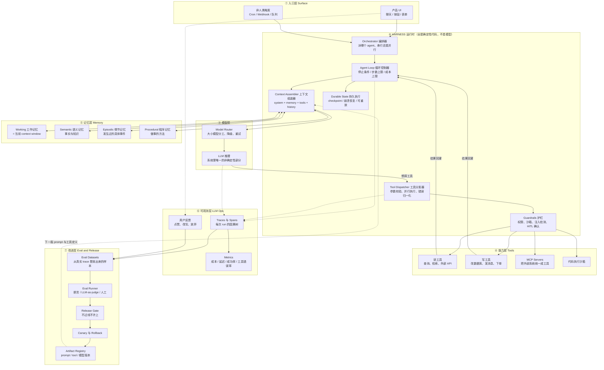
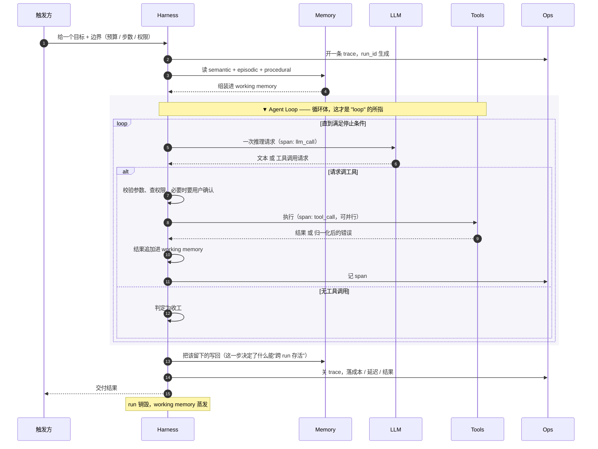
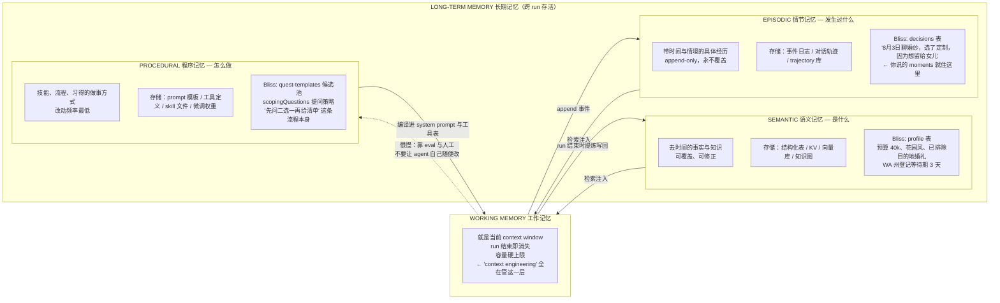
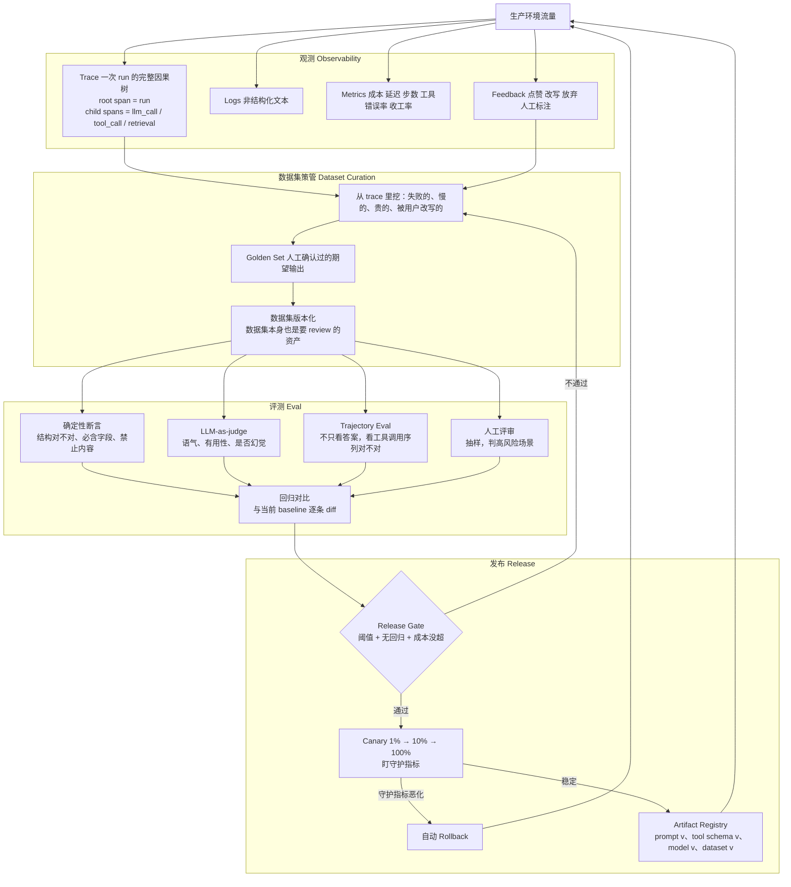

# 工业级 Agentic System 参考图与术语辨析

**用途：** 理清 harness / loop / ephemeral run / 三种 memory / trace / eval release 这些词各自
指什么、住在系统的哪一层、以及在 Bliss 里对应什么。

**怎么看这个文件：** VSCode 里按 `Cmd+Shift+V` 打开 Markdown 预览，Mermaid 图会渲染出来。
若图不显示，装扩展 `Markdown Preview Mermaid Support`，或把代码块贴到 https://mermaid.live 。

---

## 图 1 · 静态分层架构（这些词各住哪一层）

**读这张图的一句话总结：** 模型只住在 ②→③ 之间那一小格里。所谓"做 agent"，
九成工作量在 harness、memory、ops、eval 这四层，都是普通工程。

---

## 图 2 · 一次 Ephemeral Agent Run 的生命周期（动态视角）

`ephemeral`（短暂的）指的就是这张图：**一次 run 被创建、干活、还回结果、然后销毁**，
除了它显式写进 memory 的东西，什么都不留下。

**停止条件（stop condition）必须写死，这是 agent 和"死循环烧钱"的唯一区别：**

| 类型 | 例子 |
|---|---|
| 自然收工 | 模型这一轮不再调工具 |
| 终止工具 | 调用了 `submit_answer` / `commit_tasks` |
| 预算耗尽 | max_steps、max_tokens、max_cost、wall-clock |
| 外部中断 | 用户打断、上游取消 |
| 护栏拦截 | 触发不可恢复的权限或安全错误 |

**Ephemeral 对比 Persistent：**

| | Ephemeral Run | Persistent / Long-lived Agent |
|---|---|---|
| 生命周期 | 一个任务，几秒到几分钟 | 跨天、跨会话常驻 |
| 上下文 | 全新，干净，隔离 | 累积，会漂移、会污染 |
| 可并行 | 天然可以，互不干扰 | 难 |
| 可重放 | 容易（输入确定） | 难 |
| 状态怎么活 | **只靠写进 Memory 层** | 靠自己的进程内状态 |
| 工业界现状 | 主流做法 | 少数场景 |

> 工业界现在几乎都选 ephemeral：**把"持续性"交给 Memory 层，而不是交给一个长命进程。**
> 这样 agent 可以随时崩、随时重启、随时横向扩，而记忆不丢。

---

## 图 3 · 三种 Memory 的区别（这组词最容易混）

这套分类借自认知心理学，2020 年代被搬进 agent 领域。关键分辨问题：
**这条信息是"是什么"、"发生过什么"、还是"怎么做"？**

**一句话辨析：**

- **Semantic** = 百科条目。「他们预算 4 万美元」
- **Episodic** = 日记条目。「8 月 3 日我们聊到预算，她说超 4 万会吵架」
- **Procedural** = 操作手册。「聊预算时先问弹性，再报数字」

**最容易踩的坑：** 把三种都丢进一个向量库然后 `similarity_search`。
它们的读写模式根本不同 —— semantic 要**准确**、episodic 要**完整有序**、procedural 要**版本可控**。
向量检索只适合"量大到装不下"的那部分，通常只有 episodic 的历史长尾需要。

**还有一条：procedural memory 的写入必须慢。** 让 agent 自己修改自己的做事方法，
听起来很酷，实际是最快的质量崩塌路径。它应该走图 4 那条 eval 流水线，而不是运行时自己改。

---

## 图 4 · LLM Ops 与 Eval Release 闭环（怎么持续变好而不变坏）

**这里几个词的精确区别：**

| 词 | 是什么 | 不是什么 |
|---|---|---|
| **Log** | 一行文本，「发生了 X」 | 没有因果结构 |
| **Span** | 一个带起止时间、输入输出、成本的操作单元 | 不是一整次 run |
| **Trace** | 一次 run 里所有 span 组成的树 | 不是聚合数字 |
| **Metric** | 聚合数字，用来报警 | 不能用来 debug 单个 case |
| **Eval** | 离线、可复现、跑在固定数据集上、有分数 | 不是"我手动试了几句感觉不错" |
| **Eval Release** | 把 eval 当 CI 门禁：不过线不许发 | 不是发完再看效果 |

**Trace 是 eval 的原料，这是整个闭环的关键连接。** 没有 trace 就没有真实失败样本，
没有失败样本 eval 就只能测你想得到的情况 —— 而 agent 出事的地方永远是你想不到的那些。

---

## 术语总表（含 Bliss 对应物）

| 术语 | 一句话定义 | 住在哪层 | Bliss 里是什么 |
|---|---|---|---|
| **Harness** | 模型外面那一整套确定性运行时：组装上下文、跑循环、分发工具、管权限与预算 | ② | Fastify 里的 agent 服务；Claude Code 本身就是一个 harness |
| **Agent Loop** | 组装 → 推理 → 调工具 → 回灌 → 再推理，直到满足停止条件 | ② | Scoping Loop（问 2-3 个问题后 commit）与 Companion Loop |
| **Ephemeral Agent Run** | 一次有界执行，用完即弃，状态只靠写进 memory 存活 | ②③ | 用户点进「婚纱」触发的那一次 scoping run |
| **Working Memory** | 当前 context window 本身 | ⑤ | 那 2-3k tokens 的组装结果 |
| **Semantic Memory** | 去时间的事实 | ⑤ | `profile` 表、`ruledOut`、州级登记规则表 |
| **Episodic Memory** | 带时间的具体经历 | ⑤ | `decisions` 表（append-only，用 `supersedes` 串改主意） |
| **Procedural Memory** | 做事的方法 | ⑤ | `quest-templates.ts` 候选池、提问策略、system prompt |
| **Context Engineering** | 在有限窗口里放对东西的工程 | ② | 固定装配顺序 + 稳定前缀走 prompt caching |
| **Tool / Function Calling** | 模型请求执行一个有 schema 的操作 | ③④ | `propose_tasks`、`record_decision`、`lookup_marriage_license` |
| **MCP** | 把外部系统统一暴露成工具的协议 | ④ | 未来接 Google Calendar、供应商目录、合同邮箱 |
| **Guardrails** | 运行时的硬约束 | ② | 写操作必须 propose → 用户确认；法律信息必须查表 |
| **HITL** | 关键动作前要人确认 | ② | `commit_tasks` 必须用户点一下 |
| **Durable Execution** | 可 checkpoint、可崩溃恢复、可重放 | ② | 一次 scoping 中断后能接着走 |
| **Trace / Span** | 一次 run 的因果树 / 树上一个节点 | ⑥ | 每次 scoping run 一条 trace |
| **Eval** | 离线、可复现、有分数的批量测试 | ⑦ | golden path：12 个月 + 租婚纱 → 清单不含「量体修改」 |
| **Trajectory Eval** | 评的是工具调用序列，不只是最终文本 | ⑦ | 是否先 `get_decisions` 再提问（防重复提问） |
| **LLM-as-judge** | 用模型给模型的输出打分 | ⑦ | 语气是否「温柔不催促」 |
| **Release Gate** | eval 不过线不许发 | ⑦ | prompt 改动进 CI |
| **Canary** | 小流量试发 + 守护指标 + 自动回滚 | ⑦ | 新 prompt 先给 5% 用户 |
| **Artifact Registry** | prompt / 工具 schema / 模型 / 数据集全部版本化 | ⑦ | 每份清单记下生成它的 prompt 版本 |

---

## 成熟度分级（判断自己该在哪一级）

| 级 | 特征 | 需要的东西 |
|---|---|---|
| **L0 单次调用** | 一次 prompt 一次回答，无工具 | 就一个 API key |
| **L1 工作流** | 你写死的步骤，每步调一次模型 | + prompt 版本管理 |
| **L2 工具型 Agent** | 模型自己决定调哪个工具，有 loop 和停止条件 | + harness、tool schema、护栏、trace |
| **L3 有记忆的 Agent** | 跨会话记得用户，semantic/episodic 分开存 | + memory 层、检索、写回策略 |
| **L4 可持续演进** | trace → dataset → eval → gate → canary 闭环跑通 | + eval 基建、registry、回滚 |

**我对 Bliss 的判断：目标是 L3，现在是 L0。**

而且 L3 的前置不是 L2，是**先把 L1 做到极好** —— 也就是我上一条说的 Template Resolver：
纯确定性、不接模型、按标签筛任务。先证明「选租赁 vs 选定制得到两份明显不同的好清单」这件事
本身有价值，再让模型接管"问哪些问题"。

L4 的 eval 基建看着像大厂配置，但对你有一条现在就该做的：
**从第一天起就把每次生成的 (输入 profile, 选择, 输出清单) 三元组存下来。**
这就是你未来的 eval 数据集，成本几乎为零，但事后补不回来。

---

## 常见误解速查

| 误解 | 实际 |
|---|---|
| 「agent = 会调工具的 LLM」 | agent = LLM + harness + loop + 停止条件 + 记忆。少了 harness 只是 function calling |
| 「memory = 向量数据库」 | 向量库只是 semantic/episodic 的一种存储实现。小规模下结构化表更准、更便宜、更好 debug |
| 「多个 agent 比一个强」 | 多 agent 主要代价是上下文分裂。除非任务真能独立并行，否则一个 agent + 好工具更强 |
| 「eval 就是写测试」 | eval 输出是分布与分数，不是通过/失败。要有 baseline 对比和阈值，不是断言等号 |
| 「先上线，看用户反馈再改」 | 没有 trace，用户反馈无法定位到哪一步出错。observability 要先于上线 |
| 「让 agent 自己学习进化」 | 让它自己改 procedural memory 是最快的质量崩塌路径。演进要走 eval 流水线 |
| 「agent 要常驻才有记忆」 | 恰恰相反：ephemeral run + 外置 memory 才是工业主流，能崩、能重启、能扩容 |

---

## 参考坐标（对应关系，方便你查资料时定位）

| 这份文档里的层 | 业界常见工具 |
|---|---|
| Harness | Claude Agent SDK、LangGraph、Temporal（durable）、自研 |
| Tools / MCP | Model Context Protocol |
| Memory | Postgres + pgvector、Redis、Zep、Mem0、LangMem |
| Trace | LangSmith、Braintrust、Langfuse、W&B Weave、Arize Phoenix、OpenTelemetry GenAI semconv |
| Eval / Release | Braintrust、LangSmith Evals、Promptfoo、自建 CI 门禁 |
