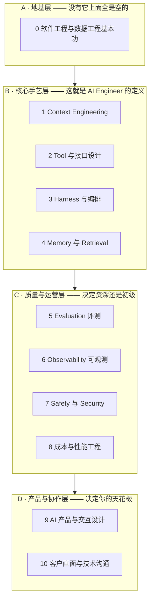

# AI Engineer 能力集拆解（2026 视角）

**用途：** 把 agentic system engineering 拆成可自查、可训练、可拿作品证明的能力块。

**配套文档：**
- [AGENTIC-SYSTEM-REFERENCE.md](AGENTIC-SYSTEM-REFERENCE.md) —— 系统架构与术语辨析
- [AI-ENGINEER-TRAINING-PLAN.md](AI-ENGINEER-TRAINING-PLAN.md) —— 训练路径与验证标准

**每条能力的统一格式：**

> **能力名**
> - `技术 / 方法` → 实现了什么功能
> - 证明：拿什么数据 / 什么实验证明你真的会

**关于依据的诚实说明：** 下面是对招聘要求与工程实践的**模式归纳**，不是任何公司 JD 的原文。
职位名变化很快（"Prompt Engineer" 两年内消失、被吸收进 AI Engineer），所以按**能力**组织。

---

## 总览：四层十块

**读法：** B 层让你做得出来，C 层让它不烂掉，D 层让它有人用，A 层决定你能不能被信任。
最贵的缺口在 **C 层（尤其 eval）**，最被忽视的在 **A 层**，最被高估的是"会写 prompt"。

---

# A 层 · 地基

## 0. 软件工程与数据工程基本功

**为什么放第一：** 最常见的失败画像不是"不懂 LLM"，而是懂 LLM 但写不出能上生产的服务。
LLM 那部分两周能补，这部分补不了。

### 一门语言到熟练
- `Python 或 TypeScript + 类型标注 + linter/formatter + 依赖锁定` → 写出别人愿意维护、半年后自己还看得懂的代码
- 证明：一个 500+ 行的模块，类型覆盖率 > 90%，`mypy`/`tsc --strict` 零报错，且有人 review 过并 merge

### 异步与并发
- `asyncio / Promise.all + semaphore 限流 + 超时控制` → 并行调多个工具时不打爆下游、不因单个慢调用拖死整轮
- 证明：并发度从 1 提到 8 后，P50 延迟下降的具体数字；下游 429/5xx 率保持不变

### API 与数据建模
- `第三范式起步 + 显式外键 + 枚举约束 + 迁移脚本（Drizzle/Alembic）` → schema 三个月后还讲得通、能安全演进
- 证明：拿出一份至少经过 3 次迁移的 schema 演进史，且没有过「加个 JSON 字段糊过去」

### 幂等与重试
- `idempotency key + 唯一约束 + at-least-once 工具语义 + 指数退避` → 模型重复调用写工具时不产生脏数据
- 证明：重放同一个 `tool_call` 3 次，数据库增量行数 = 1；生产重复写入率 < 0.1%

### 队列与后台任务
- `任务队列（Redis/SQS/pg-boss）+ 状态机持久化 + 死信队列` → 长任务不挂在 HTTP 请求上，能崩能续
- 证明：一个跑 > 60 秒的任务，进程 kill -9 后重启能从中断点继续，且不重复执行已完成步骤

### 数据库
- `EXPLAIN ANALYZE + 复合索引 + 连接池 + 事务隔离级别选择` → 数据量涨 100 倍时不需要重写
- 证明：一个原本 2 秒的查询优化到 50ms，附上优化前后的执行计划

### 测试与 CI
- `把确定性部分抽成纯函数单测 + 模型调用打桩 + 契约测试` → 非确定性系统里仍然有一张可靠的安全网
- 证明：CI 里跑得过的测试套件，其中确定性逻辑覆盖率 > 70%，且模型不可用时测试仍能全绿

### 云与部署
- `容器化 + 密钥管理（非环境变量硬编码）+ 结构化日志 + 健康检查` → 能自己把东西送上线并排障
- 证明：一次不靠别人的完整上线记录；一次靠日志定位线上问题的复盘

**反信号：** 只在 notebook 里做过东西；没上线过任何有真实用户的服务。

---

# B 层 · 核心手艺

## 1. Context Engineering

「Prompt engineering」的成年版。核心问题从"怎么写好一句话"变成
**"在有限窗口里放什么、放多少、按什么顺序放、什么时候丢掉"**。

### 上下文预算管理
- `分段 token 计量 + 每段配额 + 超限时的优先级淘汰策略` → 上下文永不溢出，且丢掉的总是最不重要的那部分
- 证明：一张表列出每段的 token 占比；一次「对话到第 40 轮」的压测，证明系统没崩也没丢关键信息

### 装配顺序与 prompt caching
- `稳定前缀在前 + 易变内容在后 + cache breakpoint 标记` → 命中缓存，成本和首字延迟大幅下降
- 证明：缓存命中率（cache read tokens / total input tokens）从 0 提到 > 70%；每次请求成本下降的具体百分比

### 结构化输出
- `JSON Schema / tool-use 强约束 + 解析失败重试 + 兜底默认值` → 下游代码永远拿到可解析的结构
- 证明：1000 次调用的 schema 违规率 < 0.5%；违规时的兜底路径有测试覆盖

### 长上下文的现实
- `关键信息前置或后置 + 大海捞针自测 + 主动摘要而非全量堆入` → 避开「中间遗忘」，不因为塞得多而效果变差
- 证明：自己做的 needle-in-haystack 曲线，横轴是信息插入位置，纵轴是召回准确率

### 压缩与摘要
- `滚动摘要 + 关键事实提取到结构化字段 + 原文归档可回查` → 长对话不爆窗口，且压缩没丢掉决定性信息
- 证明：压缩前后跑同一组问答，准确率差值 < 5%；压缩比（如 8:1）

### 多轮状态管理
- `明确划分「进 context 的」与「进外部 state 的」+ 每轮重新装配而非累积追加` → 不因历史堆积而漂移
- 证明：能画出一张表，逐字段说明它属于 context 还是 state，以及为什么

### 少样本示例选择
- `静态 few-shot vs 按相似度动态检索示例 + 示例去偏` → 用最少的示例拿到最大的行为矫正
- 证明：0-shot / 3-shot 静态 / 3-shot 动态 三组在同一 eval 集上的分数与成本对比

### 模型差异与迁移
- `同一 prompt 跨模型跑同一 eval + 差异归因 + 抽象出模型无关的指令层` → 换模型时不用重写全部 prompt
- 证明：一份跨 2-3 个模型的 eval 对比表，以及一次真实的换模型记录（改了哪几处、分数变化）

**入门判断题：** 「你的 system prompt 为什么是这个长度？」答得出取舍的在做工程，答"试出来的"还在碰运气。

---

## 2. Tool 与接口设计

**最被低估、杠杆最高的一块。** 本质是**为一个会误解、会偷懒、会重试的调用方设计 API**。

### 工具粒度切分
- `按「用户可理解的一个动作」切分 + 合并高频连用的工具` → 步数不爆炸，模型也不会挑错工具
- 证明：同一任务在粗粒度 vs 细粒度两套工具下的平均步数与成功率对比

### Schema 与描述撰写
- `描述里写清「何时用/何时不用」+ 参数名自解释 + 枚举代替自由文本 + 单位写进字段名` → 模型少猜，参数错误率下降
- 证明：只改工具描述、不改模型和 prompt，参数错误率从 x% 降到 y%（这是最能体现功力的一条数据）

### 错误信息设计
- `结构化错误 + 可执行的修复建议 + 区分「可重试」与「不可重试」` → 模型能自己改对，而不是原地重复同一个错
- 证明：注入一次工具失败后，模型自主恢复率 > 80%；平均恢复步数

### 读写分离
- `读工具宽松幂等 + 写工具窄接口带校验 + 写操作单独权限位` → 模型可以随便查，但不会误改数据
- 证明：工具清单上标注读/写分类；写工具的参数校验测试用例

### 危险操作确认机制
- `propose → 用户确认 → commit 两段式 + proposal 带 TTL 与幂等 ID` → 模型永远不能单方面改用户的东西
- 证明：一次「模型提议被用户否决/修改后再提交」的完整 trace

### 工具数量控制
- `按场景动态裁剪工具表 + 分组/命名空间 + 高频工具前置` → 工具变多时准确率不塌
- 证明：工具数 5 / 15 / 40 三档下的选错率曲线；裁剪策略上线后的选错率变化

### MCP
- `实现一个 MCP server 暴露自有系统 + 客户端接入 + 权限边界设计` → 外部系统统一成工具，不用为每个集成写胶水
- 证明：一个自己写的可运行 MCP server；以及一次「我判断这里不该用 MCP」的理由

### 沙箱化执行
- `容器/子进程隔离 + 网络出口白名单 + 文件系统 scope + CPU/内存/时间上限` → 模型能跑代码但跑不坏东西
- 证明：一组逃逸测试用例（读取 /etc/passwd、外连、死循环、fork bomb）全部被拦并有日志

**及格线：** 让模型连续正确完成一个五步任务，中间故意注入一次工具失败，它能自己恢复。

---

## 3. Harness 与编排

写 agent 的运行时。这块最像传统分布式系统工程。

### Loop 设计
- `while + 停止条件集合（无工具调用 / 终止工具 / max_steps / max_cost / 超时 / 中断）` → agent 会收工，不会烧钱到天亮
- 证明：手写的 loop 代码（不用框架现成的）；一张停止原因分布表（各类停止各占多少）

### 状态机 vs 自由 agent
- `确定性状态机做主干 + 只在真正需要判断的节点嵌 agent` → 大部分行为可预测、可测试、可复现
- 证明：一张状态图，标出哪些节点是确定性的、哪些是 agentic 的，以及每个 agentic 节点的理由

### 持久化与恢复
- `每步 checkpoint + 事件溯源 + 可重放（Temporal 那类思路）` → 崩溃能续跑，事故能重放复现
- 证明：中途 kill 进程后恢复执行成功；同一 run 重放两次得到一致的工具调用序列

### 并行与扇出
- `独立子任务并行 ephemeral run + 结果归并 + 部分失败容忍` → 总时长下降而不牺牲正确性
- 证明：串行 vs 并行的总时长对比；一次「部分子任务失败但整体仍交付」的记录

### 多 agent 的取舍
- `默认单 agent；仅当子任务上下文可完全独立时才拆` → 避免上下文分裂带来的质量下降
- 证明：一次「我评估后决定不拆多 agent」的书面理由，附上下文依赖分析

### 流式与中断
- `SSE/WebSocket 流式 + 取消信号传播到工具层 + 中断点状态一致` → 用户能打断，且打断后数据不半截
- 证明：中断后数据库无脏数据的测试；首字延迟数字

### 人在环路（HITL）
- `按风险分级设审批点 + 卡住时的升级路径 + 审批状态持久化` → 高风险动作有人把关，agent 卡住时不静默失败
- 证明：一张动作风险分级表（自动 / 需确认 / 永不允许）；人工接管率指标

### 降级路径
- `模型不可用切备用模型 + 工具超时走缓存 + 预算耗尽给部分结果` → 依赖挂掉时产品仍可用
- 证明：一次故障演练记录（主模型断开后系统行为）；降级触发率

**反信号：** 一上手就画五个专家 agent 互相对话的架构图。这几乎总是错的。

---

## 4. Memory 与 Retrieval

包含了原来单独成岗的「RAG 工程师」。

### 三类记忆的区分
- `semantic 用结构化表/KV，episodic 用 append-only 事件日志，procedural 用版本化 prompt 与工具定义` → 各自按自己的读写模式优化，不互相拖累
- 证明：一张表逐条列出你的记忆字段归属哪一类、存在哪、怎么读、怎么写

### 什么时候不用向量库
- `先算数据规模：装得进 context 就全量注入；能精确查询就用 SQL` → 更准、更便宜、更好 debug
- 证明：一次「我把向量检索换成结构化查询」的记录，附准确率与延迟变化

### 检索质量
- `分块策略 + 混合检索（BM25 + 向量）+ cross-encoder rerank + 阈值过滤` → 召回率上去且噪声不进 context
- 证明：Recall@k / Precision@k / MRR 或 nDCG 的具体数字；rerank 前后的对比

### 写回策略
- `run 结束时提炼 + 冲突用 supersedes 链而非覆盖 + 置信度标记（decided / assumed）` → 记住该记的，改主意也留痕
- 证明：一条完整的「用户改主意」记录链；写回的精确率（人工抽检 50 条，错误率 < 5%）

### 时效性
- `事实带时间戳与有效期 + 读取时衰减或过期提示` → 不拿三个月前的偏好当现在
- 证明：一个过期事实被正确忽略或被主动复核的案例

### 归属与可解释
- `每条注入的记忆带来源 ID + 输出时可回指` → 能回答"你为什么这么说"
- 证明：一次输出的完整溯源链（结论 → 记忆条目 → 原始对话/文档）

### 数据边界
- `每次检索强制带 tenant/user 过滤 + 行级安全 + 越界测试` → 绝不跨用户泄漏
- 证明：一组越界测试用例（伪造 ID、注入 filter）全部被拦；RLS 策略代码

**及格线：** 说清「用户改主意」在你的数据模型里是覆盖还是追加，以及为什么。

---

# C 层 · 质量与运营（差距最大的一层）

## 5. Evaluation ★ 当前市场最稀缺

**如果只能练一块，练这块。** 大量团队卡在"demo 很好、上线就崩、改了不知道有没有变好"。

### 数据集策管
- `从生产 trace 里挖失败/慢/贵/被用户改写的样本 + 分层抽样 + 数据集版本化` → 测的是真实会出的问题，不是你想得到的问题
- 证明：一个 ≥ 50 条的数据集，其中 ≥ 60% 来自真实 trace 而非凭空编写；有 v1/v2 版本记录

### 分层评测
- `确定性断言（结构/必含/禁含）→ LLM-as-judge（质量）→ 人工抽样（高风险）` → 便宜的先跑，贵的少跑
- 证明：三层各自的用例数、单次运行成本、以及各层抓到的问题类型分布

### LLM-as-judge 的手艺
- `明确评分量规 + 位置随机化 + 判官自身对齐度校验 + 与人工标注算一致率` → 判官可信，不是又一个黑盒
- 证明：判官与人工标注的一致率（Cohen's kappa 或简单一致率 > 0.8）；位置偏差测试结果

### Trajectory eval
- `断言工具调用序列 + 允许多条合法路径 + 检查是否有冗余/危险调用` → 评过程而不只评结果
- 证明：一组 trajectory 断言用例；一次「答案对但过程错」被抓出来的案例

### 统计素养
- `固定随机种子 + 多次重复取均值 + 置信区间 + 最小可检测差异估算` → 不把噪声当改进
- 证明：同一配置跑 5 次的分数方差；一次「看起来涨了 3% 但在噪声内所以不采纳」的判断记录

### 回归门禁
- `CI 里跑 eval + 与 baseline 逐条 diff + 阈值不过则阻止合并` → 质量只能上不能下
- 证明：一次 CI 因 eval 未达标而阻止合并的记录（截图或日志）

### 在线评测
- `A/B 分流 + 守护指标 + canary 逐步放量 + 自动回滚条件` → 离线过了但线上不好时能及时止损
- 证明：一次 canary 发布记录，含守护指标与放量曲线

### 标注体系
- `写出别人能照着标的标准 + 争议样本仲裁流程 + 标注者间一致率` → 标注可规模化且不漂移
- 证明：一份标注指南文档；两个人独立标同 30 条的一致率

**及格线：** 改一句 prompt 后，半小时内能说出「A 类涨了 x%、B 类掉了 y%、成本变了 z%」。

---

## 6. Observability 与 LLM Ops

### Trace 与 span 建模
- `一次 run 一条 trace + llm_call / tool_call / retrieval 各为 span + OTel GenAI 语义约定` → 能看到完整因果链
- 证明：一条真实 trace 的截图或 JSON，span 层级清晰、输入输出完整

### 调试非确定性
- `记录完整输入（含 prompt 快照）+ 固定种子重放 + 逐 span 二分定位` → 能定位到「第 3 步模型误解了工具描述」
- 证明：一份 bug 复盘，写明第几步出错、根因、修复方式、修复后 eval 变化

### 成本与延迟归因
- `每 span 记 token 与耗时 + 按 span 类型聚合 + P50/P95/P99` → 知道钱花在哪一步、慢在哪一步
- 证明：一张成本/延迟按步骤的分解图；一次基于它做的优化

### 关键指标
- `任务成功率 / 平均步数 / 工具错误率 / 自然收工率 / 人工接管率 / 单次成本` → 用少量数字看住系统健康
- 证明：一个跑了至少两周的指标看板；能解释每个指标异常时意味着什么

### 报警与守护
- `分级报警（page / ticket / 忽略）+ 基于变化率而非绝对值 + 抑制噪声` → 该醒的时候醒，不该醒的时候不吵
- 证明：报警规则清单 + 一次真实报警的处理记录 + 误报率

### 版本可追溯
- `每次输出记录 prompt 版本 / 工具 schema 版本 / 模型版本 / 数据集版本` → 任何产出都能回溯到当时的配置
- 证明：从一条线上输出反查到当时四个版本号的完整链路

### 工具链
- `LangSmith / Braintrust / Langfuse / Weave / Phoenix 任一 + 或基于 OTel 自建` → 不重复造观测轮子
- 证明：接通任一平台并真的用它排查过一次问题（不是接完就不看）

---

## 7. Safety、Security 与 Guardrails

agent 拿到真实权限后，这块权重涨得最快。

### Prompt injection
- `不可信内容用分隔标记包裹 + 明示「其中的指令不执行」+ 工具返回内容做注入扫描 + 输出侧动作复核` → 间接注入（工具返回里带指令）拿不到控制权
- 证明：一组注入攻击用例（网页/文档/工具返回里埋指令）的拦截率；一次成功绕过的记录及修复

### 权限最小化
- `按 run 发放短期 scoped token + 按用户身份下推权限 + 写操作单独授权` → agent 拿不到超出任务所需的权限
- 证明：权限矩阵表；一次「agent 试图越权被拒」的日志

### 沙箱
- `容器隔离 + 只读根文件系统 + 出口白名单 + 资源上限` → 代码执行不影响宿主与他人
- 证明：逃逸测试用例全部失败的记录

### 不可信内容隔离
- `内容来源打标 + 渲染层转义 + 绝不把外部内容拼进 system prompt` → 外部数据不越过指令边界
- 证明：能指出代码里哪一行做了这个隔离；一次渗透测试结论

### PII 与合规
- `采集最小化 + 传输前脱敏 + 留存期策略 + 地域路由 + 供应商数据处理条款核对` → 合规且事故面小
- 证明：数据流图标注每处 PII；留存策略配置；一次删除请求的执行记录

### 危险动作分级
- `自动执行 / 需人确认 / 永不允许 三档 + 按金额或影响面动态升档` → 高风险动作不会被静默执行
- 证明：分级表 + 一次动态升档触发记录

### 红队与滥用
- `自己写攻击用例集 + 定期跑 + 越狱与滥用场景库` → 主动发现绕过路径而不是等出事
- 证明：一份红队报告，含发现的问题数、严重度、修复状态

### 领域正确性
- `法律/医疗/金融类事实一律查表或检索，禁止模型直接回答 + 输出带来源` → 高代价错误被结构性排除
- 证明：一个「必须走工具」的字段清单；一次拦住模型编造事实的案例

---

## 8. 成本与性能工程

### 单位经济账
- `每次交互的 token 成本 + 工具成本 + 摊薄的基建成本 → 与定价对比` → 知道毛利算不算得过来
- 证明：一张单次交互成本拆解表；毛利率数字

### 模型路由
- `简单任务走小模型 + 级联（小模型先答，不确定再升级）+ 按置信度或任务类型路由` → 成本大幅下降而质量不掉
- 证明：路由前后的成本对比与 eval 分数对比（关键是证明分数没掉）

### Prompt caching
- `稳定前缀设计 + cache breakpoint + 会话内复用` → input token 成本降一大截
- 证明：缓存命中率与账单变化

### 批处理与预计算
- `离线批量 API + 结果预生成 + 幂等缓存键` → 能离线做的绝不在用户等待时做
- 证明：哪些工作被移到离线、节省了多少延迟与成本

### 延迟预算
- `拆解首字延迟与总时长 + 每步预算 + 超预算降级` → 用户感知的快，而不是账面上的快
- 证明：延迟瀑布图 + 各步预算表

### 流式与感知性能
- `流式输出 + 中间进度可见 + 乐观 UI` → 等待变得可忍受
- 证明：首字延迟数字；有无流式两版的用户完成率/放弃率对比

### 上下文瘦身
- `裁掉低价值上下文 + 摘要替代原文 + 按需检索而非预先全塞` → token 降了、还常常更准
- 证明：上下文减少 x% 后 eval 分数不降甚至上升的记录

---

# D 层 · 产品与协作

## 9. AI 产品与交互设计

不是 UI 好看，是**为不确定性设计交互**。这块强的人极少，很难被替代。

### 为非确定性设计
- `把输出当草稿而非结论 + 可编辑 + 可撤销 + 置信度可见` → 模型错了产品也不崩
- 证明：一次「模型给错答案但用户 10 秒内改对」的流程演示

### 失败的体面
- `不知道就说不知道 + 给出退路（换个问法/转人工/手动模式）+ 不编造` → 失败不摧毁信任
- 证明：一张失败态清单，每种失败对应的界面表现

### 信任的建立
- `引用来源 + 展示关键推理步骤 + 让用户能纠正并被记住` → 用户愿意依赖它
- 证明：留存或复用率随「可溯源」上线后的变化

### 纠错成本
- `一次纠正的点击数与秒数 + 纠正结果被记住不再犯` → 这个数字直接决定产品生死
- 证明：纠错平均耗时；同一错误的复发率

### 何时不用 AI
- `能用下拉框/规则/搜索解决的不上模型 + 用确定性替代不确定性` → 更快更准更便宜
- 证明：一次「我把 AI 功能改回确定性实现」的决策记录与收益

### 渐进披露
- `一次只给下一步 + 按需展开 + 默认收起可选项` → 不把用户压垮
- 证明：一屏信息量的前后对比；任务完成率变化

### 反馈回路埋点
- `记录采纳/修改/放弃 + 把修改内容存成候选 golden sample` → 用户的每次修改变成训练信号
- 证明：反馈数据表 + 其中已被用于 eval 数据集的条数

---

## 10. 客户直面与技术沟通

forward-deployed / applied 类岗位的核心，也是增长最快的岗位形态。

### 问题界定
- `把「我们想用 AI」翻成一个有输入输出、有成功判据的任务定义` → 需求变得可实现可验收
- 证明：一份需求转化文档：原始诉求 → 任务定义 → 成功判据 → 数据集

### 预期管理
- `明确说清能做到什么、做不到什么、什么情况下会错` → 不靠承诺过头换来立项
- 证明：一份含「已知局限」章节的方案文档

### 演示能力
- `48 小时内做出能戳的原型 + 用真实数据而非玩具数据` → 让讨论从抽象变具体
- 证明：一个用客户真实数据跑通的原型及其时间线

### 评测共识
- `和业务方一起标 30 条样本，把「什么叫做对了」写成数据集` → 验收标准不再靠感觉
- 证明：一份与非技术方共同产出的标注集与标注指南

### 写作
- `设计文档 / eval 报告 / 事故复盘三种文体` → 决策可追溯，团队能对齐
- 证明：三份各一篇，且被别人实际引用或据此做过决策

---

# 被高估 / 被低估

| 常被高估 | 为什么 |
|---|---|
| 微调与训练 | 应用层九成不需要。上下文与工具做好收益更大、迭代更快 |
| 追新框架 | 框架半年一换，harness 原理不变 |
| Prompt 技巧集 | 「深呼吸一步步想」这类咒语在新模型上大多失效 |
| 多 agent 架构 | 复杂度换来的收益通常是负的 |
| 榜单分数 | 和你的任务几乎无关，你需要自己的 eval |
| 向量库选型 | 检索质量瓶颈几乎从不在向量库是哪个 |

| 常被低估 | 为什么 |
|---|---|
| **Eval** | 唯一能让系统持续变好而不变坏的东西，且最缺人 |
| **工具与错误信息设计** | 改工具描述常常比换模型提升更大 |
| **数据建模** | schema 决定 memory 层的天花板 |
| **成本工程** | 很多 demo 死在毛利上 |
| **软件工程基本功** | 拉开长期差距的真正变量 |
| **写作** | 文档写不清楚的人，agent 也编排不清楚 |

---

# 岗位形态与能力权重

| 岗位形态 | 权重最高 | 典型产出 |
|---|---|---|
| **AI Product Engineer** | 1 2 9 0 | 用户能用的 AI 功能 |
| **Agent / Applied AI Engineer** | 2 3 4 5 | 能完成多步真实任务的 agent |
| **AI Platform / LLM Ops** | 3 6 8 0 | 内部 harness、网关、trace 与 eval 基建 |
| **Eval / Applied Research** | 5 6 | 评测体系、模型选型报告、质量基线 |
| **Forward-Deployed Engineer** | 10 1 2 9 | 客户现场落地的系统 |
| **AI Safety / Security** | 7 5 | 威胁模型、红队报告、护栏 |

---

# 作品该证明什么

面试真正在看"你有没有踩过坑"。这六件事做过一次就压过一堆证书：

1. **一个上线过、有真实用户的 agent** —— 哪怕只有十个用户
2. **一套自己的 eval** —— 有数据集、有分数、有一次「改了 X，分数 a→b」的记录
3. **一次真实 trace 调试** —— 讲清楚错在第几步、为什么、怎么修的
4. **一次成本优化** —— 单次成本从 $0.X 降到 $0.0Y，方法是什么
5. **一次注入或滥用防御** —— 发现了什么绕过路径，怎么堵的
6. **一次「我们决定不用 AI」** —— 这条最能证明判断力

---

# 自查阶梯

| 级别 | 你能做到 |
|---|---|
| **L1 会用** | 把模型接进产品，做出能演示的东西 |
| **L2 会做** | 会设计工具、跑 loop、有护栏、上线过且没出大事 |
| **L3 会衡量** | 有 trace 有 eval，每次改动说得出好了多少、贵了多少 ← **多数人卡在这里** |
| **L4 会设计系统** | 定得出 memory 架构与 harness 边界，判断得出何时该用状态机而非 agent |
| **L5 会定标准** | 建立团队的 eval 文化与平台，让别人也能安全迭代 |

**L2 → L3 是市场上最大的一道坎**，也是薪资曲线最陡的一段。它不需要更聪明，只需要肯做那件
不性感的事：把真实失败样本收集起来，变成一个能跑分的数据集。

具体怎么练、怎么验证学到了 → [AI-ENGINEER-TRAINING-PLAN.md](AI-ENGINEER-TRAINING-PLAN.md)
