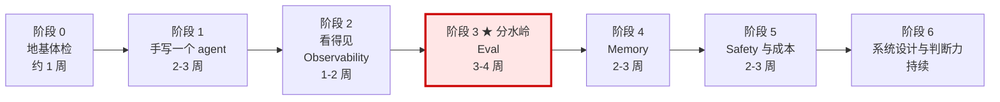

# AI Engineer 训练与验证计划

**配套：** [AI-ENGINEER-CAPABILITIES.md](AI-ENGINEER-CAPABILITIES.md)（能力清单） ·
[AGENTIC-SYSTEM-REFERENCE.md](AGENTIC-SYSTEM-REFERENCE.md)（系统与术语）

**载体：** 大部分训练直接用 Bliss 做。有真实产品做载体的训练效果远高于教程练手项目 ——
因为只有真实产品会给你"数据脏、用户不按预期用、成本超预算"这些真问题。

---

## 一、设计原则

**这份计划的验证标准全部是「拿得出的东西」，不是「感觉懂了」。**

学 AI 工程最大的陷阱是：读文档时的理解感非常强，但那是**识别**而不是**生成**。
你看懂一个 eval 框架的文档，和你能从零建起一个能挡住你自己烂改动的 eval 门禁，
差距是几十小时的动手。所以每个训练项的验证标准都写成：

- **可量化**：有数字，能对照
- **可失败**：存在明确的"不通过"判定，不是自我评价
- **有产出物**：代码 / 数据集 / 报告，跑得起来或看得见

### 三条铁律

1. **不许用「我理解了」作为完成标志。** 完成标志只能是产出物 + 数字。
2. **每一项训练必须包含一次失败。** 没失败过说明题目太简单，不算练到。
3. **能被替代的产出不算产出。** 「跑通了官方 quickstart」不算，「用它排查了一个真实 bug」才算。

---

## 二、路线图

**关键提醒：阶段 3 是分水岭，不要跳过，也不要提前。**
提前做 eval（还没有真实 trace 时）只能测你想得到的问题，价值有限；
跳过 eval 直接做 memory，你会做出一个不知道好坏的复杂系统。

---

# 阶段 0 · 地基体检（约 1 周）

目的不是学新东西，是**找出你的地基漏洞**。跳过这一阶段的人，后面所有问题都会被误诊成"AI 的问题"。

### D0.1 幂等性实战
- **做什么：** 给 Bliss 的一个写接口（比如 `commit_tasks`）加幂等保护
- **交付物：** 带 idempotency key 的接口 + 唯一约束迁移 + 重放测试
- **通过标准：** 同一请求体连发 5 次，数据库增量行数 = 1，且 5 次返回相同结果（含首次创建的 ID）
- **不算通过：** 只在应用层判重（进程重启或多实例就失效）；用 `SELECT` 再 `INSERT`（有竞态）

### D0.2 并发与限流
- **做什么：** 写一个并行调用 N 个下游的函数，带并发上限和超时
- **交付物：** 代码 + 一份压测结果
- **通过标准：** 并发度 1 → 8，P50 延迟下降 ≥ 50%；下游错误率不上升；单个下游卡死时整轮仍在超时内返回
- **不算通过：** 用 `Promise.all` 无限并发；超时没传播（下游还在跑）

### D0.3 崩溃恢复
- **做什么：** 一个多步长任务，支持中断续跑
- **交付物：** 状态持久化设计 + 一段 kill -9 后恢复的录屏或日志
- **通过标准：** 在第 3 步 kill，重启后从第 3 步继续，前 2 步不重复执行，最终结果与不中断时一致
- **不算通过：** 从头重跑；「重复执行也没关系」（那是没做，不是不需要）

### D0.4 查询优化
- **做什么：** 找 Bliss 里最慢的一个查询，优化它
- **交付物：** 优化前后的 `EXPLAIN ANALYZE` 对比
- **通过标准：** 耗时下降 ≥ 5 倍，且你能解释是哪个索引/改写起的作用
- **不算通过：** 加了索引但说不清为什么变快

**阶段 0 出口检验（口头，不看笔记）：**
1. 事务隔离级别里，「可重复读」防不住什么？
2. at-least-once 和 exactly-once 的区别，以及为什么工具调用几乎只能做到前者？
3. 你的服务开两个实例，哪些代码会出问题？

---

# 阶段 1 · 手写一个 agent（2-3 周）

**核心要求：不用 LangGraph、不用任何 agent 框架，自己写 loop。**
框架会替你做掉恰好是你需要学的那部分。学完之后再用框架，你会知道它在替你解决什么。

### D1.1 最小 loop
- **做什么：** 一个 agent，2 个工具（一读一写），手写循环
- **技术：** 原生 SDK 的 tool use + while 循环 + 消息数组累积
- **交付物：** 不超过 200 行的 `agent.ts` / `agent.py`
- **通过标准：**
  - 能连续完成一个需要 ≥ 3 次工具调用的任务
  - 6 类停止条件全部实现并各有一个测试：无工具调用 / 终止工具 / max_steps / max_cost / 超时 / 用户中断
  - 故意把 max_steps 设成 2，能优雅地告知"我没做完"，而不是抛异常
- **不算通过：** 只实现了"无工具调用就停"；没有成本上限

### D1.2 工具描述的威力（★ 我认为最值得做的一个练习）
- **做什么：** 设计一个模型容易用错的工具，然后**只改描述和参数命名**，不改模型不改 prompt
- **技术：** 枚举替代自由文本、单位写进字段名、描述里写「何时不用」、错误信息给修复建议
- **交付物：** 一张对照表：改动前后的描述文本 + 各跑 30 次的参数错误率
- **通过标准：** 参数错误率相对下降 ≥ 50%，且你能逐条说明每处改动对应哪类错误
- **不算通过：** 一次改了五处说不清哪处有效（要一次改一处）

### D1.3 错误恢复
- **做什么：** 在工具里注入失败，让 agent 自主恢复
- **技术：** 结构化错误 + 可执行修复建议 + 区分可重试/不可重试
- **交付物：** 一组注入测试（参数错、下游 500、超时、权限不足、业务规则拒绝）
- **通过标准：** 自主恢复率 ≥ 80%；不可重试错误时不做无意义重试（重试次数 = 0）
- **不算通过：** 恢复靠的是模型运气而不是错误信息设计（对照实验：把错误信息换成 `"Error"`，恢复率应显著下降，这反证了你的设计有效）

### D1.4 状态机 vs agent 的判断
- **做什么：** 把 Bliss 的 scoping 流程画成状态图，标出哪些节点确定性、哪些 agentic
- **交付物：** 一张图 + 每个 agentic 节点的书面理由
- **通过标准：** agentic 节点数量 ≤ 总节点数的 1/3，且每个都能回答「为什么这里写不成 if-else」
- **不算通过：** 全都是 agentic（说明还没理解边界）

**阶段 1 出口检验（口头）：**
1. 你的 loop 有几种停止方式？各自触发时用户看到什么？
2. 工具太多时模型会怎么退化？你怎么缓解？
3. 为什么写工具要 propose/commit 两段，而读工具不用？

---

# 阶段 2 · 看得见（1-2 周）

**没有观测就没有后面的一切。** eval 的原料来自 trace。

### D2.1 自建 trace
- **做什么：** 先手写一遍 trace，再接平台
- **技术：** run_id + span 树 + 每 span 记 input/output/tokens/latency/cost
- **交付物：** 一条真实 run 的 trace JSON，能看出完整因果链
- **通过标准：** 从 trace 能独立回答：总花了多少钱、最慢的一步是哪步、模型在第几步改变了策略
- **不算通过：** 只有日志没有层级；没记 token 与成本

### D2.2 接一个平台
- **做什么：** 接 Langfuse / LangSmith / Braintrust / Phoenix 任一
- **通过标准：** **用它排查过一个真实 bug**，并写出复盘
- **不算通过：** 接通了但没用它解决过问题

### D2.3 一次真实的非确定性 debug
- **做什么：** 找一个"有时对有时错"的行为，定位根因
- **技术：** 完整输入快照 + 重放 + 逐 span 二分
- **交付物：** 一份复盘，含：现象 / 复现步骤 / 出错在第几步 / 根因 / 修复 / 修复后的验证
- **通过标准：** 根因能定位到具体某个 span 的某个输入；修复后同样输入连跑 20 次不再复现
- **不算通过：** 「加了一句 prompt 好像好了」

### D2.4 成本与延迟归因
- **交付物：** 一张按 span 类型分解的成本与延迟表 + P50/P95
- **通过标准：** 能指出成本占比最高的一步，并提出一个可验证的优化假设
- **不算通过：** 只有总数没有分解

**阶段 2 出口检验（口头）：**
1. log、span、trace、metric 各自解决什么问题，不能互相替代在哪？
2. 你的系统里哪一步最贵？第二贵？为什么？
3. 给你一条失败的 trace，你的排查顺序是什么？

---

# 阶段 3 ★ 分水岭 · Eval（3-4 周）

**这是整个计划的核心。做完这一阶段，你就跨过了 L2→L3 那道坎。**
这一阶段最不好玩，也最值钱。

### D3.1 第一个数据集
- **做什么：** 从阶段 2 的真实 trace 里挖样本
- **技术：** 分层抽样（失败 / 慢 / 贵 / 被用户改写 / 正常对照）+ 数据集版本化
- **交付物：** ≥ 50 条的数据集，每条含输入、期望、来源 trace ID、分类标签
- **通过标准：**
  - ≥ 60% 来自真实 trace，不是凭空编的
  - 有明确分层，每层 ≥ 5 条
  - 有 v1 → v2 的版本变更记录（说明你真的在迭代它）
- **不算通过：** 全是自己想出来的 happy path；没有分类标签

### D3.2 三层评测
- **交付物：** 确定性断言层 + LLM-as-judge 层 + 人工抽样层，各自可独立运行
- **通过标准：**
  - 确定性层单次运行 < 30 秒且成本 ≈ 0
  - 三层各自抓到的问题类型明显不同（拿出一张分布表证明）
  - 全套跑一次的成本你说得出具体数字
- **不算通过：** 只有 LLM-as-judge（贵、慢、还不稳）

### D3.3 判官的可信度校验
- **做什么：** 评测你的评测者
- **技术：** 明确量规 + 位置随机化 + 与人工标注算一致率
- **交付物：** 判官 vs 人工在 ≥ 30 条上的一致率
- **通过标准：** 一致率 ≥ 0.8；且做过位置偏差测试（A/B 调换顺序结论不变的比例 ≥ 90%）
- **不算通过：** 直接信任判官分数没做过校验

### D3.4 Trajectory eval
- **做什么：** 评过程不只评结果
- **交付物：** 一组工具调用序列断言，允许多条合法路径
- **通过标准：** 至少抓到一个「答案对但过程错」的案例（例如没先查 decisions 就重复提问）
- **不算通过：** 只断言最终文本

### D3.5 统计纪律
- **做什么：** 建立"这个改进是真的吗"的判断流程
- **技术：** 固定种子 + 重复 5 次 + 计算方差 + 最小可检测差异
- **交付物：** 同一配置 5 次运行的分数分布
- **通过标准：** 你知道自己 eval 的噪声幅度是多少；并且**有一次记录：某个改动看起来涨了但在噪声内，你决定不采纳**
- **不算通过：** 跑一次就下结论

### D3.6 CI 门禁 ★
- **做什么：** 把 eval 接进 CI，不过线阻止合并
- **交付物：** CI 配置 + 一次被阻止的真实记录
- **通过标准：** **你自己提的一个 PR 被自己的 eval 挡下来过**（这一条是整个阶段 3 的毕业证）
- **不算通过：** 配了门禁但阈值松到从没挡住任何东西

### D3.7 完整的一次量化改进
- **做什么：** 走完 "改动 → 跑 eval → 量化 → 决策" 全流程
- **交付物：** 一份 eval 报告
- **通过标准：** 报告能回答：A 类涨了多少 / B 类掉了多少 / 成本变了多少 / 延迟变了多少 / 我采纳还是不采纳，为什么。**全程 ≤ 30 分钟**
- **不算通过：** 拿不出成本和延迟这两栏（只看质量不看代价是初级）

**阶段 3 出口检验（口头）：**
1. eval 和单元测试的本质区别是什么？
2. 你的 eval 噪声是多少？涨多少你才认？
3. 你的数据集里最有价值的 5 条是哪几条，为什么？
4. LLM-as-judge 会有哪三种系统性偏差？你分别怎么处理？

---

# 阶段 4 · Memory（2-3 周）

**注意顺序：先有 eval 再做 memory。** 否则你做出的是一个不知道好坏的复杂系统。

### D4.1 三类记忆分离落地
- **做什么：** 在 Bliss 里把 profile（semantic）/ decisions（episodic）/ templates（procedural）分开实现
- **交付物：** 一张字段归属表 + schema + 读写路径
- **通过标准：** 每个字段能回答「属于哪类、存哪、什么时候读、什么时候写、能不能覆盖」；三者的存储选型不同且理由成立
- **不算通过：** 全塞一张表或全丢向量库

### D4.2 改主意的建模
- **做什么：** 处理"用户推翻之前决定"
- **技术：** append-only + `supersedes` 链 + 置信度标记（decided / assumed）
- **通过标准：** 能查出一条完整决策演变链，且历史不丢；agent 读取时只看到最新有效决定，但被问起时能讲出演变过程
- **不算通过：** UPDATE 覆盖

### D4.3 「不用向量库」的判断
- **做什么：** 先用结构化查询实现记忆检索，测量它，再判断要不要上向量
- **交付物：** 一份对比：结构化 vs 向量在你的真实数据上的准确率、延迟、成本
- **通过标准：** 有数据支撑的选型结论。**如果结论是"不需要向量库"，这一项算满分**
- **不算通过：** 默认上向量库没做过对比

### D4.4 检索质量量化
- **技术：** 混合检索 + rerank
- **交付物：** Recall@k / Precision@k 数字（若走了检索路线）
- **通过标准：** rerank 前后有对比数字；能说出你的分块策略为什么是这个
- **可跳过条件：** D4.3 的结论是不需要检索 —— 但要在文档里写明

### D4.5 记忆的越界测试
- **做什么：** 确保记忆不跨用户泄漏
- **交付物：** 一组越界测试（伪造 user_id、注入 filter、并发混淆）
- **通过标准：** 全部被拦，且拦截发生在数据层（RLS 或强制 where），不只在应用层
- **不算通过：** 只靠应用层记得加 filter

### D4.6 记忆质量的 eval
- **做什么：** 用阶段 3 的方法评你的记忆系统
- **通过标准：** 有一个 memory 专项数据集，含：应该记住的、应该忘掉的、已排除项不该再推荐的、过期事实不该采信的。写回精确率人工抽检 ≥ 95%
- **不算通过：** 觉得"它好像记得住"

**阶段 4 出口检验（口头）：**
1. semantic / episodic / procedural 各举一个你系统里的真实例子
2. 用户改主意在你的表里发生了什么？为什么不用 UPDATE？
3. 什么情况下你会上向量库？你现在为什么（不）上？

---

# 阶段 5 · Safety 与成本（2-3 周）

### D5.1 间接注入攻防
- **做什么：** 自己攻击自己 —— 在工具返回内容里埋指令
- **技术：** 不可信内容分隔标记 + 明示不执行 + 输出侧动作复核
- **交付物：** ≥ 10 条注入用例（网页内容、文档、工具返回、用户上传文件）+ 拦截率
- **通过标准：** 拦截率 ≥ 90%，**且必须有至少一次成功绕过的记录及修复**（没绕过成功说明你攻得不够狠）
- **不算通过：** 只测了"忽略之前的指令"这种最幼稚的注入

### D5.2 权限与沙箱
- **交付物：** 权限矩阵 + 逃逸测试用例
- **通过标准：** 逃逸测试（读敏感文件、外连、死循环、资源耗尽）全部失败并有日志；agent 的凭证是按 run 发放的短期 scoped token
- **不算通过：** agent 用的是管理员级别长期密钥

### D5.3 危险动作分级
- **交付物：** 一张三档分级表（自动 / 需确认 / 永不允许）+ 动态升档规则
- **通过标准：** 表里每一档都有真实条目；有一次动态升档的触发记录
- **不算通过：** 全部归到"自动"

### D5.4 领域正确性护栏
- **做什么：** 找出你系统里"模型答错代价极高"的字段，改成必须查表
- **通过标准：** 一份「禁止模型直接回答」的字段清单 + 一次拦住模型编造的案例。用 eval 验证：这类问题的事实错误率 = 0
- **Bliss 例子：** marriage license 的等待期与有效期必须查州级规则表

### D5.5 单位经济账
- **交付物：** 单次交互成本拆解表 + 毛利估算
- **通过标准：** 能拆到 span 级；知道成本最高的一步；有一个明确的成本红线
- **不算通过：** 只知道月账单总数

### D5.6 一次真实成本优化
- **技术：** 模型路由 / prompt caching / 上下文瘦身 / 离线预计算 任选
- **通过标准：** 单次成本下降 ≥ 50%，**且用 eval 证明质量分数没有显著下降**（后半句是关键，缺了不算）
- **不算通过：** 降了成本没测质量

**阶段 5 出口检验（口头）：**
1. 间接注入为什么比直接注入危险？你的防线有几层？
2. 你系统里哪些动作永不允许自动执行？边界怎么划的？
3. 你的单次交互成本是多少？最贵的一步能不能换小模型？为什么（不）能？

---

# 阶段 6 · 系统设计与判断力（持续）

这一阶段没有明确出口，靠积累判断力。验证方式是**你的决策记录质量**。

### D6.1 判断力档案
- **做什么：** 建一个决策日志，每次架构决策记一条
- **格式：** 背景 / 选项 / 我选了什么 / 为什么 / 我可能错在哪 / 三个月后回看对不对
- **通过标准：** ≥ 10 条，且其中至少 3 条在回看时被自己判定为"当时判断错了"（**没有错判记录说明你在自我美化，不算通过**）

### D6.2 一次「决定不用 AI」
- **通过标准：** 一份决策文档，说明为什么确定性方案更好，以及落地后的收益数字
- **为什么重要：** 这是最难伪装的判断力证据

### D6.3 一次「决定不拆多 agent」
- **通过标准：** 上下文依赖分析 + 结论。能说清多 agent 的具体代价在你这个场景里是什么

### D6.4 教会别人
- **通过标准：** 写一份别人能照着做的文档，且**真的有人照着做成了**
- **为什么是最高验证：** 能教会别人是理解深度的最强证据

---

# 三、记分卡（定期填）

复制这张表，每月填一次。只填"有产出物"的那一格才算。

| 能力块 | 训练项 | 状态 | 产出物位置 | 关键数字 | 最后更新 |
|---|---|---|---|---|---|
| 0 地基 | D0.1 幂等 | ☐ | | 重复写入率 | |
| 0 | D0.2 并发 | ☐ | | P50 降幅 | |
| 0 | D0.3 恢复 | ☐ | | | |
| 0 | D0.4 查询 | ☐ | | 提速倍数 | |
| 1 Context | D1.1 loop | ☐ | | 停止条件覆盖 6/6 | |
| 2 Tool | D1.2 描述 | ☐ | | 参数错误率降幅 | |
| 2 | D1.3 恢复 | ☐ | | 自主恢复率 | |
| 3 Harness | D1.4 状态机 | ☐ | | agentic 节点占比 | |
| 6 Ops | D2.1 trace | ☐ | | | |
| 6 | D2.2 平台 | ☐ | | | |
| 6 | D2.3 debug | ☐ | | 复现 20 次不再现 | |
| 6 | D2.4 归因 | ☐ | | 最贵步骤占比 | |
| **5 Eval** | **D3.1 数据集** | ☐ | | 条数 / 真实占比 | |
| **5** | **D3.2 三层** | ☐ | | 单次成本 | |
| **5** | **D3.3 判官** | ☐ | | 一致率 | |
| **5** | **D3.4 trajectory** | ☐ | | | |
| **5** | **D3.5 统计** | ☐ | | 噪声幅度 | |
| **5** | **D3.6 CI 门禁** | ☐ | | 被挡次数 | |
| **5** | **D3.7 量化改进** | ☐ | | 全流程耗时 | |
| 4 Memory | D4.1 三类分离 | ☐ | | | |
| 4 | D4.2 改主意 | ☐ | | | |
| 4 | D4.3 向量判断 | ☐ | | 对比数字 | |
| 4 | D4.5 越界 | ☐ | | 拦截率 | |
| 4 | D4.6 memory eval | ☐ | | 写回精确率 | |
| 7 Safety | D5.1 注入 | ☐ | | 拦截率 / 绕过数 | |
| 7 | D5.2 权限沙箱 | ☐ | | | |
| 7 | D5.3 分级 | ☐ | | | |
| 7 | D5.4 领域护栏 | ☐ | | 事实错误率 | |
| 8 成本 | D5.5 经济账 | ☐ | | 单次成本 | |
| 8 | D5.6 优化 | ☐ | | 降幅 / 质量变化 | |
| — 判断力 | D6.1 决策档案 | ☐ | | 条数 / 错判数 | |
| — | D6.2 不用 AI | ☐ | | | |
| — | D6.4 教会别人 | ☐ | | | |

状态符号：`☐` 未开始 · `◐` 在做 · `✔` 通过 · `✔✔` 30 天后复测仍通过

---

# 四、30 / 90 天回归自测

**这是这份计划里最容易被跳过、但最重要的机制。**
短期突击学到的东西 30 天后大部分会退化成"我记得我做过"。

**规则：**
- 每项训练通过后，在日历上记下 +30 天和 +90 天
- 到期时**不看笔记**回答该阶段的出口检验题，并**重跑一次自己的验证实验**
- 答不出或跑不通 → 状态从 `✔` 退回 `◐`，重做该项
- 两次复测都通过 → 标 `✔✔`，可以认为这项真的长在身上了

**退化最快的三项**（我的判断，重点复测）：
1. 统计纪律（D3.5）—— 最容易退回"跑一次就下结论"
2. 状态机判断（D1.4）—— 最容易退回"什么都交给 agent"
3. 成本意识（D5.5）—— 最容易在赶功能时被忘掉

---

# 五、监测协议（怎么让我来验你）

这份文档在 repo 里，后续你可以直接说「按 TRAINING-PLAN 验我 D3.1」，我会按下面的方式做。

**你要提供的：**
1. 产出物的文件路径或 PR
2. 关键数字
3. 一句话说明你做了什么

**我会做的：**
1. **读产出物本身**，不只听你描述
2. **抽查通过标准里的每一条**，逐条给通过 / 不通过 / 存疑
3. **问 2-3 个出口检验题**，重点问"为什么这样做"而不是"你做了什么"
4. **主动找你的自欺** —— 见下面清单
5. 给一个明确结论：`通过` / `部分通过（缺哪几条）` / `不通过（原因）`

**我不会做的：**
- 不会因为你努力了就给通过
- 不会接受"我理解了"作为证据
- 不会跳过成本和延迟那两栏

**要求我严格一点的说法：** 「按 D3.6 的标准验我，不要放水」。

---

# 六、自欺清单（我会重点查这些）

| 自欺形式 | 真实标准 |
|---|---|
| 「我看懂那个框架的文档了」 | 你手写过一遍它替你做的事吗？ |
| 「跑通了 quickstart」 | 你用它解决过一个自己的真实问题吗？ |
| 「我的 eval 分数很高」 | 数据集是不是全是你想得到的 happy path？真实 trace 占比多少？ |
| 「改了 prompt 效果变好了」 | 跑了几次？噪声幅度多少？成本变了吗？ |
| 「加了护栏」 | 你自己攻破过它吗？有绕过成功的记录吗？ |
| 「有 trace 了」 | 你用它定位过一个 bug 吗？还是接完就没看？ |
| 「memory 能记住用户」 | 用户改主意时会怎样？过期信息会怎样？跨用户会泄漏吗？ |
| 「成本优化了 60%」 | 质量分数变了多少？没测就等于不知道 |
| 「我的判断都挺对的」 | 决策档案里有几条自己判错的？零条就是在美化 |
| 「这个我以前做过」 | 30 天回归测过吗？不看笔记还答得出吗？ |

---

# 七、如果只有 8 周

按这个顺序，砍掉一切非必要：

| 周 | 做什么 | 出口 |
|---|---|---|
| 1 | D0.1 幂等 + D0.3 恢复 | 地基不塌 |
| 2-3 | D1.1 手写 loop + D1.2 工具描述实验 | 一个能跑的 agent + 一张参数错误率对照表 |
| 4 | D2.1 trace + D2.3 一次真实 debug | 一份 debug 复盘 |
| **5-7** | **D3.1 数据集 → D3.6 CI 门禁 → D3.7 量化改进** | **被自己 eval 挡下来的一个 PR** |
| 8 | D5.6 成本优化（用 eval 守住质量） | 成本降一半、质量没掉 |

**第 5-7 周是全部价值所在。** 前面是为它铺路，后面是它的应用。
如果时间被压缩到只剩三周，就只做第 5-7 周那一段 —— 哪怕 agent 简陋一点。
